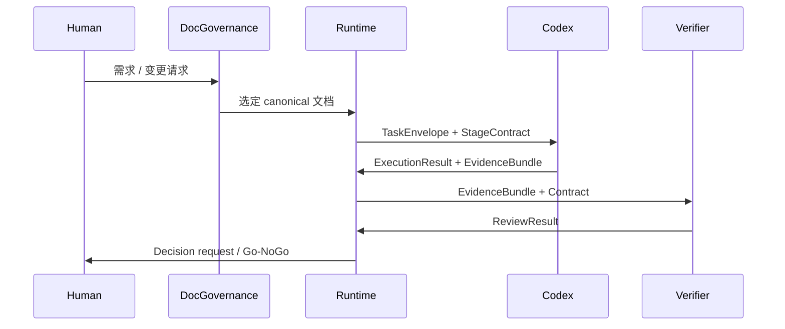

# Agent Team Skill 与 Runtime 协议设计

日期：2026-05-01

## 目标

把 `Agent Team` 从“单个 workflow 文档 + CLI 运行时”升级成一套可复用的 Agent Team 产品协议层，统一覆盖：

- 文档治理
- 任务分发
- Codex 执行
- 沙箱 / runtime gate / 外部模型审查
- 人工决策
- 前端控制台展示

这套设计不是把所有逻辑塞进 `AGENTS.md`，而是把它拆成清晰分层：

- `AGENTS.md`：薄入口，只负责触发和指路
- `agent-team` skill：协作协议入口
- `ai-driven-doc`：需求/设计治理
- `agent_team` runtime：状态机、协议、落盘、验证、服务
- `apps/web`：可视化控制台

## 为什么需要这层

当前项目已经有这些东西：

- `Agent Team` 的 stage workflow
- `agent-team` CLI runtime
- React + Tailwind 控制台
- `Product / Dev / QA / Acceptance` 角色 context / contract
- `ai-doc-driven-dev` 的文档治理思路

但还缺一个统一的“上层协议”来回答这些问题：

- 什么时候进入 `agent-team` 协作体系
- 执行器和验证器如何交换信息
- 哪些内容必须写成结构化 artifact
- 哪些判断由 runtime 控制，哪些由模型负责
- 前端要展示哪些 stage / evidence / review 状态

## 设计结论

### 1. `AGENTS.md` 只做入口

`AGENTS.md` 不承载完整业务协议，只做：

- 识别该项目启用 `agent-team`
- 指向 skill / runtime
- 声明禁止事项
- 说明文档优先级

### 2. 专门新增 `agent-team` skill

这个 skill 是“协作协议”，不是执行引擎。

它负责说明：

- Agent Team 的阶段模型
- 角色边界
- 任务和证据格式
- Codex 与验证器的职责分离
- 与 `ai-driven-doc` 的接入方式

### 3. Runtime 才是事实来源

真正负责流程推进的是 `agent_team` runtime：

- 状态机
- artifact 落盘
- evidence 读取
- review 记录
- human decision
- WebSocket / REST 输出

### 4. Codex 执行，验证器审查

执行器和验证器不做自由聊天式 peer-to-peer 通信，而是通过 runtime 交换结构化包：

```text
human request
  -> doc governance
  -> task envelope
  -> Codex execution
  -> evidence bundle
  -> verifier review
  -> runtime decision
  -> human go/no-go
```

## 非目标

- 不把所有流程写进 prompt
- 不让 skill 自己接管 stage machine
- 不做自由对话式模型互聊
- 不用新的文档体系取代现有 workflow docs
- 不把 `ai-driven-doc` 替换掉

## 协议分层

### 1. 文档治理层

负责确定“这个需求属于哪个 canonical 文档”：

- 新需求 -> 新 requirement/design pair
- 既有功能变化 -> 更新原文档
- 返工/bug -> 回写原始文档，而不是新开平行说明

这里继续复用 `ai-driven-doc` 的逻辑。

### 2. 协作协议层

建议新增 `agent-team` skill，作为对外入口：

- 触发 workflow
- 说明阶段契约
- 指向 runtime
- 约束角色边界

### 3. 执行运行时层

`agent_team` 负责：

- session 状态
- stage transition
- handoff artifact
- verifier 接口
- console API
- websocket 状态推送

### 4. 前端可视化层

`apps/web` 负责：

- 项目地图
- 项目工作台
- 会话详情
- 证据和审查结果
- 连接状态

## 推荐目录结构

```text
project-root/
├── SKILL.md
├── AGENTS.md
├── docs/
│   ├── requirements/
│   ├── designs/
│   ├── workflow-specs/
│   └── standards/
├── agent-team/
│   ├── project/
│   │   ├── context.md
│   │   ├── rules.md
│   │   ├── glossary.md
│   │   ├── architecture.md
│   │   ├── roles/
│   │   └── protocols/
│   ├── worktrees/
│   └── sessions/
├── agent_team/
│   ├── console_data.py
│   ├── web_server.py
│   ├── web_assets.py
│   ├── project_structure.py
│   ├── protocols/
│   ├── handoff/
│   ├── verifiers/
│   └── orchestrator/
└── apps/
    └── web/
```

### 目录语义

- `protocols/`：schema、枚举、结果类型
- `handoff/`：session 级交接包读写
- `verifiers/`：验证器 adapter
- `orchestrator/`：状态机、gate、retry、resume

## 核心数据对象

建议统一这些结构：

| 对象 | 作用 |
| --- | --- |
| `TaskEnvelope` | 一次 stage 执行的输入包 |
| `StageContract` | 当前阶段允许做什么、必须交什么 |
| `ExecutionResult` | Codex 执行后的结果摘要 |
| `EvidenceBundle` | 命令、日志、diff、截图、trace |
| `ReviewResult` | QA、runtime gate 或外部模型的审查结论 |
| `DecisionRecord` | 人工决策记录 |
| `RuntimeEvent` | 状态变更和消息事件 |

这些对象建议都能导出成 JSON，且支持落盘和回放。

## 通信模型

### 不推荐

- Codex 和外部模型自由聊天
- 把业务规则藏在 prompt 里
- 用自然语言代替证据包

### 推荐

- runtime 生成结构化任务包
- Codex 只执行当前 stage contract
- Codex 输出结构化 evidence bundle
- 验证器只审查 evidence bundle 和 contract
- runtime 根据 review result 做门禁和流转

## 文件夹标准

### project-global

项目级共享上下文放在 `agent-team/project/`，主要是：

- `context.md`
- `rules.md`
- `glossary.md`
- `architecture.md`
- `roles/*.context.md`
- `protocols/*.json`

### worktree-global

`worktrees/<worktree_id>/` 放某条需求线或代码工作区的共享上下文。

### session

`sessions/<session_id>/` 放一次具体 workflow 的全部运行产物。

### stage run

`runs/` 或 `stage_runs/` 放某个 stage 的一次尝试和 gate 结果。

### canonical docs vs working docs

项目级 `docs/` 是 canonical 文档源头。  
session 内不再使用 `docs/` 作为命名，改成 `working_docs/`，避免和项目级 `docs/` 冲突。

### project existing structure first

优先识别项目已有的文档结构并建立 `doc-map.json`。  
如果项目没有可用结构，再落默认目录：

```text
docs/
├── requirements/
├── designs/
├── workflow-specs/
└── standards/
```

## Stage 流程



## 与现有 workflow 的关系

这份设计不是推翻现有 `Agent Team`，而是把它升级为可扩展协议层。

保留这些既有能力：

- `Product -> Dev -> QA -> Acceptance -> Human`
- 文件化 handoff
- stage gate
- review 回流
- learning / feedback 机制

新增这些能力：

- agent-team 专用 skill
- 结构化 verifier contract
- 执行器 / 验证器分层
- console 中展示 evidence / review / rework
- 更清晰的文档治理入口

## 与 `ai-doc-driven-dev` 的关系

两者不是重复，而是上下游关系：

- `ai-driven-doc` 负责“这个需求该归哪份文档”
- `agent-team` 负责“这份文档如何进入执行、验证、决策链路”

因此，当工作属于已有功能或已有 workflow 时，先走文档治理，再进入 runtime。

## 前端控制台改造方向

当前 React 控制台已经有：

- 项目地图
- 项目工作台
- 会话详情
- 语言切换
- WebSocket 连接状态

后续要补的是：

- verifier / reviewer 状态
- evidence bundle 列表
- rework loop 计数
- human decision 历史
- 当前 stage contract 摘要

### 当前 websocket 状态问题

如果前端一直显示“连接中 / 重连中”，说明 runtime 的 WebSocket upgrade 不稳定。

这类问题应该被视为 runtime 依赖问题，而不是前端状态 bug。设计上要求：

- runtime 必须提供可用 websocket 支持
- 若 websocket 不可用，前端需要降级到 REST 轮询并明确标识
- 状态文本需要区分首次连接、重连中、降级模式

## 实施阶段建议

### Phase 0

- 修复 runtime WebSocket 依赖
- 明确连接状态语义
- 让控制台稳定显示 live 状态

### Phase 1

- 新增 `agent-team` skill
- 定义 `TaskEnvelope` / `StageContract` / `EvidenceBundle` / `ReviewResult`
- 在 runtime 中实现 schema 校验

### Phase 2

- 新增 handoff artifact writer
- 新增 verifier adapter，DeepSeek 只是可选外部模型实现
- 前端展示 review / evidence / rework

### Phase 3

- 把 `ai-driven-doc` 作为 canonical routing 层接入 runtime
- 支持更多角色或 verifier provider
- 让 stage policy 可配置但不失控

## 成功标准

这套设计成立的标志是：

- `AGENTS.md` 足够薄
- `agent-team` skill 可以独立描述整个协作协议
- 执行器和验证器之间没有自由聊天式耦合
- 所有关键结果都能落成结构化 artifact
- 前端能看到“执行 / 验证 / 返工 / 人工决策”的完整链路
- `ai-driven-doc` 仍然是文档治理入口，不被重复替代
