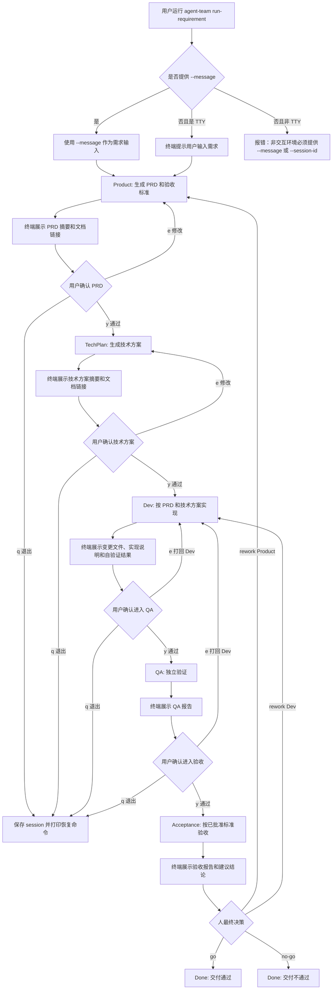
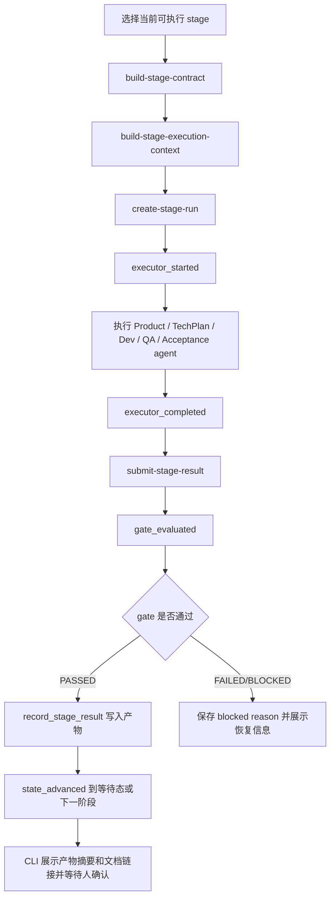

# agent-team run-requirement 交互式流程设计

日期：2026-05-02

## 背景

当前 `agent-team run-requirement --message "写个js文件，并打印hello world"` 会由 runtime 自动执行 Product 阶段，生成 `prd.md` 后停在 `WaitForCEOApproval`。终端只打印状态摘要、产物目录和下一步命令。这个行为对 runtime 来说是正确的，但对人类 CLI 用户不友好：

- 用户看不到阶段执行中发生了什么。
- 用户不知道 Product 阶段产物就是 PRD，而不是最终代码。
- 用户需要自己打开文件确认 PRD。
- `next_action` 没有解释为什么停住、应该确认什么、确认后会发生什么。
- 技术方案对齐只存在 `agent-team dev` 交互流程里，没有成为 `run-requirement` 的正式 runtime gate。

目标是让 `agent-team run-requirement` 成为 CLI 内可观察、可确认、可恢复的主流程。用户运行命令后，终端应持续展示进度、关键产物和确认提示；内部仍由 `agent-team` runtime 控制 Product、TechPlan、Dev、QA、Acceptance 的执行与状态推进。

## 目标

1. 用户直接运行 `agent-team run-requirement` 时，可以在终端输入需求。
2. 每个关键阶段都有可见进度和阶段摘要。
3. PRD 和技术方案在终端展示阶段摘要与 Markdown 文档链接，不展示全文；实现结果、QA 报告、验收报告展示关键摘要、证据和文档链接，并等待用户确认。
4. 用户确认后，runtime 才进入下一阶段。
5. 用户可以选择修改、打回、退出并稍后恢复。
6. 模型输出可以显示或关闭，但不把隐藏推理当作产品能力暴露。
7. 非交互场景仍支持当前自动化用法，避免破坏脚本和 CI。

## 非目标

- 不把每一个内部 trace step 都变成人工确认点。
- 不要求用户确认 `contract_built`、`execution_context_built`、`stage_run_acquired` 这类 runtime 内部步骤。
- 不默认刷出所有 executor stdout，默认只展示阶段摘要、关键产物和验证结果。
- 不允许 Product 或 TechPlan 阶段写业务代码。
- 不允许 Acceptance 自动替代人的最终 Go / No-Go。

## 用户视角总流程



## Runtime 状态模型

推荐将 `run-requirement` 的交互式状态明确为下面的阶段和等待态：

```text
Intake
-> Product
-> WaitForProductApproval
-> TechPlan
-> WaitForTechPlanApproval
-> Dev
-> WaitForDevApproval
-> QA
-> WaitForQAApproval
-> Acceptance
-> WaitForHumanDecision
-> Done
```

兼容策略：

- 第一版可以继续使用现有 `WaitForCEOApproval` 存储 Product 审批状态，但终端展示应改为 `WaitForProductApproval` 或 `等待确认 PRD`。
- 如果新增正式 `TechPlan` 阶段，应同步更新 `StageMachine`、`StageContract`、`WorkflowSummary`、`status`、`panel` 和测试。
- 交互模式默认不自动越过人工 gate。`--auto` 模式仍保留 Product/CEO 对齐；TechPlan、Dev、QA 和最终 Acceptance gate 通过硬性验证后自动记录 `go` 并继续执行或完成交付。
- 自动化脚本可以继续兼容 `--auto-approve-product`、`--auto-final-decision`，但面向人类 CLI 的推荐入口是 `--auto`。

## 内部执行生命周期

每个可执行阶段内部仍使用现有 stage-run 生命周期。人工确认点只发生在阶段产物通过 gate 后。



阶段内的 trace 仍记录：

- `contract_built`
- `execution_context_built`
- `stage_run_acquired`
- `executor_started`
- `executor_completed`
- `result_submitted`
- `gate_evaluated`
- `state_advanced`

CLI 可以把这些 trace 转换成可读摘要，例如：

```text
[Product] 生成需求方案中...
- 已解析原始需求
- 已生成 Product 阶段 contract
- 已构建 Product 执行上下文
- Product agent 已完成 PRD 草稿
- PRD 已通过硬性 gate
```

## 模型输出策略

终端中的“模型思考”应定义为可见执行输出和阶段摘要，而不是隐藏推理。

推荐选项：

```bash
agent-team run-requirement --model-output summary
agent-team run-requirement --model-output raw
agent-team run-requirement --model-output off
```

默认值：`summary`

| 模式 | 行为 |
| --- | --- |
| `summary` | 展示阶段进度、关键动作、产物路径、验证结果和人类可读摘要 |
| `raw` | 额外透传 executor stdout/stderr，适合调试 |
| `off` | 只展示阶段开始、完成、确认提示和错误 |

约束：

- 不承诺展示模型隐藏推理。
- `raw` 输出也必须 tee 到 `.agent-team/<session_id>/exec` 或 `stage_runs` 下，便于复盘。
- 默认 `summary` 不应刷屏。

## 终端交互规范

### 通用阶段标题

```text
[1/5 Product] 生成需求方案中...
session: 20260502T014359728302Z-js-hello-world
artifact_dir: .agent-team/20260502T014359728302Z-js-hello-world
```

### 通用进度摘要

```text
[Product] 进度
- 已解析原始需求
- 已确认这是一个最小 Node.js 脚本需求
- 已整理验收标准
- 已写入 PRD

文档:
- PRD: .agent-team/<session_id>/prd.md

下一步:
- 请打开 PRD 文档确认是否可以作为 TechPlan 的输入
```

### 通用确认提示

```text
Approve PRD?
[y] 通过，进入技术方案
[e] 提修改意见，重新生成 PRD
[p] 重新打印文档链接
[q] 保存并退出
> 
```

阶段确认选项：

| 输入 | 含义 |
| --- | --- |
| `y` | 当前阶段产物通过，进入下一阶段 |
| `e` | 输入修改意见，当前阶段重跑或打回指定阶段 |
| `p` | 重新打印当前产物的 Markdown 文档链接或路径 |
| `q` | 保存 session 并退出，不丢失状态 |

`--auto` 模式下，Product 仍保留同样的确认提示；TechPlan、Dev、QA 和 Acceptance 只打印阶段摘要和文档链接，然后自动通过并进入下一阶段或完成交付。

退出时必须打印：

```text
Session saved.
Resume:
agent-team run-requirement --session-id <session_id>
```

## 阶段职责和确认点

### Product

输入：

- 原始需求
- 可选的人类补充说明
- 返工时记录的人工修改意见
- 仓库结构摘要

内部动作：

- 解析需求意图。
- 明确目标、用户场景和验收边界。
- 如果是返工，必须把人工修改意见折入目标、用户场景、验收标准和风险假设，而不是只写成备注。
- 生成验收标准。
- 记录假设和风险。
- 生成 `prd.md`。

终端摘要示例：

```text
[Product] 生成需求方案中...
- 已解析原始需求: 写个js文件，并打印hello world
- 已判断交付形态: Node.js 可执行脚本
- 已确定默认文件名: hello-world.js
- 已整理验收标准: stdout 必须是 hello world
- 已写入 prd.md

文档:
- PRD: .agent-team/<session_id>/prd.md
```

人类确认：

- `y`: PRD 通过，进入 TechPlan。
- `e`: 输入 PRD 修改意见，Product 重新生成。
- `q`: 保存退出。

### 返工意见回流规则

当用户在确认点选择 `e` 时，CLI 必须把用户输入原文记录为本轮 human revision request，并写入 session 的 feedback 记录。下一轮目标阶段生成执行上下文时，runtime 必须把这些修改意见作为高优先级输入传给阶段 agent。

| 节点 | 处理规则 |
| --- | --- |
| Product 返工 | 修改意见必须进入 PRD 的需求正文、用户场景、验收标准和风险假设 |
| TechPlan 返工 | 修改意见必须进入技术方案的流程图、变更范围、文件计划、验证计划和风险表 |
| Dev / QA 返工 | 修改意见必须进入实现或验证报告，并带上关闭该问题的证据 |
| Acceptance 返工 | 人需要选择返工到 Product 或 Dev，修改意见按目标阶段规则处理 |

例如用户在 PRD 确认点输入 `在桌面生成文件`，下一轮 PRD 不应只出现“收到修改意见”的备注，而应把交付位置写进目标、用户场景和验收标准。

### TechPlan

输入：

- 已批准 PRD。
- 仓库结构摘要。
- 当前项目约束。

内部动作：

- 分析应该创建或修改哪些文件。
- 生成实现步骤。
- 生成验证命令。
- 明确风险和回滚方式。
- 生成 `technical_plan.md`。

终端摘要示例：

```text
[TechPlan] 生成技术方案中...
- 已读取已批准 PRD
- 已检查仓库是否存在 package.json / JS 入口约定
- 已选择最小实现路径: 新增 hello-world.js
- 已确定验证命令: node hello-world.js
- 已写入 technical_plan.md

文档:
- Technical Plan: .agent-team/<session_id>/technical_plan.md
```

人类确认：

- `y`: 技术方案通过，进入 Dev。
- `e`: 输入技术方案修改意见，TechPlan 重新生成。
- `q`: 保存退出。

### Dev

输入：

- 已批准 PRD。
- 已批准技术方案。
- Dev execution context。

内部动作：

- 按技术方案修改代码。
- 生成实现说明。
- 运行自验证命令。
- 记录变更文件。
- 生成 `implementation.md`。

终端摘要示例：

```text
[Dev] 实现中...
- 已创建 hello-world.js
- 已写入 console.log("hello world")
- 已运行 node hello-world.js
- stdout: hello world
- stderr: empty
- exit_code: 0
```

人类确认：

- `y`: 认可 Dev 产物，进入 QA。
- `e`: 输入修改意见，打回 Dev。
- `q`: 保存退出。

### QA

输入：

- 已批准 PRD。
- 已批准技术方案。
- Dev 变更文件和实现说明。

内部动作：

- 独立运行验证命令。
- 检查 stdout、stderr、exit code。
- 检查是否有无关变更。
- 生成 `qa_report.md`。

终端摘要示例：

```text
[QA] 独立验证中...
- 已确认 hello-world.js 存在
- 已运行 node hello-world.js
- stdout 匹配: hello world
- stderr 为空
- exit_code 为 0
- 未发现无关文件变更
```

人类确认：

- `y`: QA 通过，进入 Acceptance。
- `e`: 输入问题，打回 Dev。
- `q`: 保存退出。

### Acceptance

输入：

- 已批准 PRD。
- QA 报告。
- 交付产物。

内部动作：

- 按验收标准逐项判断。
- 不引入新需求。
- 给出 `recommended_go` 或 `recommended_no_go`。
- 生成 `acceptance_report.md`。

终端摘要示例：

```text
[Acceptance] 验收中...
- AC1: hello-world.js 已创建，PASS
- AC2: node hello-world.js exit_code = 0，PASS
- AC3: stdout 为 hello world，PASS
- AC4: stderr 为空，PASS
- 建议结论: recommended_go
```

人类最终确认：

- `go`: 进入 Done，交付通过。
- `no-go`: 进入 Done，交付不通过。
- `rework Product`: 打回 Product 修改需求。
- `rework Dev`: 打回 Dev 修改实现。
- `q`: 保存退出。

## Case: 写个 js 文件，并打印 hello world

### 1. 启动

用户输入：

```bash
agent-team run-requirement
```

终端：

```text
What requirement should Agent Team run?
> 写个js文件，并打印hello world

session_id: 20260502T014359728302Z-js-hello-world
artifact_dir: .agent-team/20260502T014359728302Z-js-hello-world
```

内部逻辑：

1. CLI 检测当前是 TTY。
2. 未提供 `--message`，所以提示用户输入需求。
3. `parse_intake_message` 提取 normalized request。
4. `StateStore.create_session` 创建 session。
5. 交互式 session 应标记为 `initiator="human"`。
6. `workflow_summary.md` 初始状态为 `Intake`。

### 2. Product 生成 PRD

终端：

```text
[1/5 Product] 生成需求方案中...
- 已解析原始需求: 写个js文件，并打印hello world
- 已收敛到最小可交付范围: 一个 Node.js 脚本
- 已整理验收标准
- 已写入 PRD

文档:
- PRD: .agent-team/<session_id>/prd.md

下一步:
- 请打开 PRD 文档确认需求方案和验收标准是否通过
```

确认提示：

```text
Approve PRD?
[y] 通过，进入技术方案
[e] 提修改意见，重新生成 PRD
[p] 重新打印 PRD 文档链接
[q] 保存并退出
> y
```

内部逻辑：

1. Runtime 选择 `Product` 作为当前 stage。
2. 构建 Product contract。
3. 构建 Product execution context。
4. 创建 `product-run-1`。
5. Product executor 生成 `StageResultEnvelope`。
6. Runtime 提交 candidate bundle。
7. Gate 校验 PRD 是否包含验收标准和证据。
8. Gate 通过后写入 `prd.md`。
9. 状态进入 `WaitForProductApproval`。
10. CLI 打印 PRD 摘要、Markdown 文档路径和确认提示，不打印 PRD 全文。
11. 用户输入 `y` 后，状态进入 `TechPlan`。

### 3. TechPlan 生成技术方案

终端：

```text
[2/5 TechPlan] 生成技术方案中...
- 已读取已批准 PRD
- 已检查仓库结构
- 已选择最小实现路径: 新增 hello-world.js
- 已确定验证命令: node hello-world.js
- 已写入 technical_plan.md

文档:
- Technical Plan: .agent-team/<session_id>/technical_plan.md

下一步:
- 请打开技术方案文档确认实现路径、变更文件和验证命令是否通过
```

确认提示：

```text
Approve technical plan?
[y] 通过，进入 Dev
[e] 提修改意见，重新生成技术方案
[p] 重新打印技术方案文档链接
[q] 保存并退出
> y
```

内部逻辑：

1. Runtime 构建 TechPlan contract。
2. TechPlan context 必须包含已批准 PRD。
3. TechPlan executor 不允许写业务代码。
4. Gate 校验技术方案包含文件列表、实现步骤、验证命令。
5. Gate 通过后写入 `technical_plan.md`。
6. 状态进入 `WaitForTechPlanApproval`。
7. 用户确认后状态进入 `Dev`。

### 4. Dev 实现

终端：

```text
[3/5 Dev] 实现中...
- 已读取 PRD 和技术方案
- 已创建 hello-world.js
- 已运行自验证命令

变更文件:
- hello-world.js

验证:
- command: node hello-world.js
- exit_code: 0
- stdout: hello world
- stderr: empty

产物:
- implementation.md: .agent-team/<session_id>/implementation.md
```

确认提示：

```text
Approve Dev result?
[y] 通过，进入 QA
[e] 输入问题，打回 Dev
[p] 重新打印实现说明
[q] 保存并退出
> y
```

内部逻辑：

1. Runtime 构建 Dev contract。
2. Dev context 必须包含已批准 PRD 和技术方案。
3. Dev executor 修改仓库文件。
4. Dev executor 运行自验证。
5. Dev 输出 `StageResultEnvelope`，包含实现说明、变更文件、验证证据。
6. Gate 校验证据是否满足 contract。
7. Runtime 写入 `implementation.md`。
8. 状态进入 `WaitForDevApproval`。
9. 用户确认后状态进入 `QA`。

### 5. QA 独立验证

终端：

```text
[4/5 QA] 独立验证中...
- 已确认 hello-world.js 存在
- 已独立运行 node hello-world.js
- stdout 匹配 hello world
- stderr 为空
- exit_code 为 0
- 未发现无关变更

--- QA Report ---
Result: PASS
Evidence:
- command: node hello-world.js
- stdout: hello world
- stderr: empty
- exit_code: 0
```

确认提示：

```text
Approve QA report?
[y] 通过，进入验收
[e] 输入问题，打回 Dev
[p] 重新打印 QA 报告
[q] 保存并退出
> y
```

内部逻辑：

1. Runtime 构建 QA contract。
2. QA context 包含 PRD、技术方案、Dev 实现说明、变更摘要。
3. QA executor 不应直接修代码。
4. QA 独立运行验证命令。
5. Gate 校验 QA 报告必须有独立证据。
6. Runtime 写入 `qa_report.md`。
7. 状态进入 `WaitForQAApproval`。
8. 用户确认后状态进入 `Acceptance`。

### 6. Acceptance 验收

终端：

```text
[5/5 Acceptance] 验收中...
- 已按 PRD 验收标准逐项检查
- AC1 hello-world.js exists: PASS
- AC2 node command exit_code 0: PASS
- AC3 stdout hello world: PASS
- AC4 stderr empty: PASS
- 建议结论: recommended_go

--- Acceptance Report ---
Recommendation: recommended_go
All approved acceptance criteria passed.
```

最终确认：

```text
Final decision?
[go] 接受交付
[no-go] 不接受交付并结束
[rework Product] 打回需求方案
[rework Dev] 打回实现
[p] 重新打印验收报告
[q] 保存并退出
> go
```

内部逻辑：

1. Runtime 构建 Acceptance contract。
2. Acceptance context 包含已批准 PRD 和 QA 报告。
3. Acceptance 不新增需求，只按已批准标准验收。
4. Gate 校验 Acceptance 报告包含逐项结论。
5. Runtime 写入 `acceptance_report.md`。
6. 状态进入 `WaitForHumanDecision`。
7. 用户输入 `go` 后，`StageMachine.apply_human_decision` 推进到 `Done`。

### 7. 完成输出

终端：

```text
Workflow completed.

Final status:
- session_id: 20260502T014359728302Z-js-hello-world
- human_decision: go
- current_state: Done

Delivered files:
- hello-world.js

Artifacts:
- prd.md
- technical_plan.md
- implementation.md
- qa_report.md
- acceptance_report.md
- workflow_summary.md
```

## 恢复流程

用户在任何确认点输入 `q` 时：

```text
Session saved.
Resume:
agent-team run-requirement --session-id <session_id>
```

恢复逻辑：

1. CLI 读取 `workflow_summary.md`。
2. 如果当前状态是等待态，重新打印对应阶段产物和确认提示。
3. 如果当前状态是可执行 stage，继续执行该 stage。
4. 如果有 active stage run，先展示 active run 状态，避免重复认领。
5. 如果之前 gate blocked，展示 blocked reason、相关 trace 和恢复建议。

## 非交互模式

非 TTY 或显式 `--non-interactive` 时保留自动化语义：

```bash
agent-team run-requirement --message "写个js文件，并打印hello world" --non-interactive
```

行为：

- 不提示用户输入。
- 不等待终端确认。
- 遇到人工 gate 时返回 `waiting_human`。
- 打印明确的可执行下一步和产物路径。
- `--auto` 跳过 TechPlan / Dev / QA / Acceptance 的人工确认，不跳过阶段 banner 与 report；自动通过时仍要明确打印下一阶段名称或完成交付。
- 不允许在缺少 `--message` 和 `--session-id` 时等待 stdin。

示例输出应比当前更明确：

```text
runtime_driver_status: waiting_human
current_state: WaitForProductApproval
blocked_for: PRD approval
artifact_to_review: .agent-team/<session_id>/prd.md
continue_interactively: agent-team run-requirement --session-id <session_id>
continue_automatically_after_product_go: agent-team run-requirement --session-id <session_id> --auto
```

## 文件和模块影响

预期实现会影响：

| 文件 | 变化 |
| --- | --- |
| `agent_team/cli.py` | `run-requirement` 增加交互入口、TTY 检测、确认循环、输出模式参数 |
| `agent_team/runtime_driver.py` | 增加事件回调或 step observer，向 CLI 报告阶段进度 |
| `agent_team/stage_machine.py` | 增加 TechPlan 和中间等待态，或兼容映射旧状态 |
| `agent_team/stage_contracts.py` | 增加 TechPlan contract，补充 Dev 对 approved technical plan 的依赖 |
| `agent_team/execution_context.py` | TechPlan context 和 Dev context 纳入已批准技术方案 |
| `agent_team/state.py` | 持久化 `technical_plan.md`，等待态恢复时可读取对应产物 |
| `agent_team/status.py` | 用户友好展示 Product/TechPlan/Dev/QA/Acceptance 等待确认 |
| `agent_team/executor.py` | 支持 summary/raw/off 输出策略和 stdout/stderr tee |
| `tests/test_cli.py` | 覆盖交互确认、非交互兼容、resume、输出提示 |
| `tests/test_stage_machine.py` | 覆盖新增状态转换 |

## 验收标准

1. `agent-team run-requirement` 在 TTY 中未提供 `--message` 时会提示输入需求。
2. Product 完成后终端展示 PRD 摘要、Markdown 文档链接和确认提示，不直接静默退出，也不打印 PRD 全文。
3. 用户确认 PRD 后进入 TechPlan，而不是直接进入 Dev。
4. TechPlan 完成后终端展示技术方案摘要、Markdown 文档链接和确认提示，不打印技术方案全文。
5. Dev 完成后终端展示变更文件、实现说明和自验证结果，并等待确认进入 QA。
6. QA 完成后终端展示独立验证结果，并等待确认进入 Acceptance。
7. Acceptance 完成后终端展示验收报告，并等待最终 `go / no-go / rework`。
8. 任意确认点输入 `q` 都能保存并打印 resume 命令。
9. `--model-output off` 可以关闭 executor 输出，只保留阶段摘要和确认。
10. 非 TTY 自动化使用方式保持兼容，不会卡住等待输入。

## 关键设计原则

- Runtime 仍然拥有状态机和 gate，CLI 只是可视化和采集人工决策。
- 人只确认阶段交付物，不确认 runtime 内部机械步骤。
- Product 和 TechPlan 是写作与规划阶段，不写业务代码。
- Dev 必须基于已批准 PRD 和已批准技术方案执行。
- QA 必须独立验证，不能只复述 Dev 自测。
- Acceptance 只能按已批准验收标准判断，不能临时扩大范围。
- 所有确认、反馈、打回都必须落盘，恢复后不能依赖当前终端记忆。
