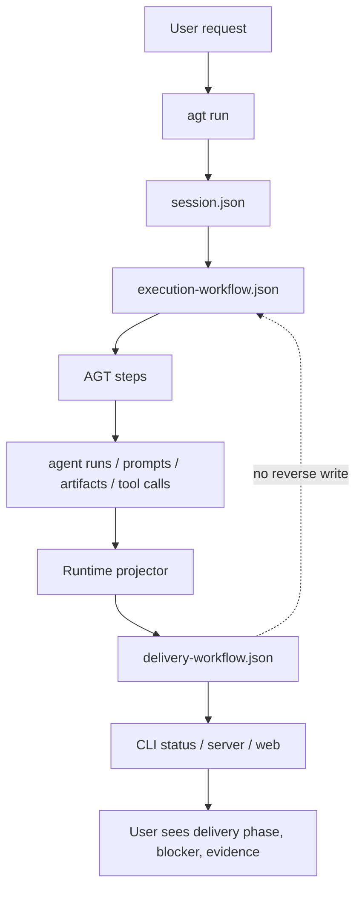
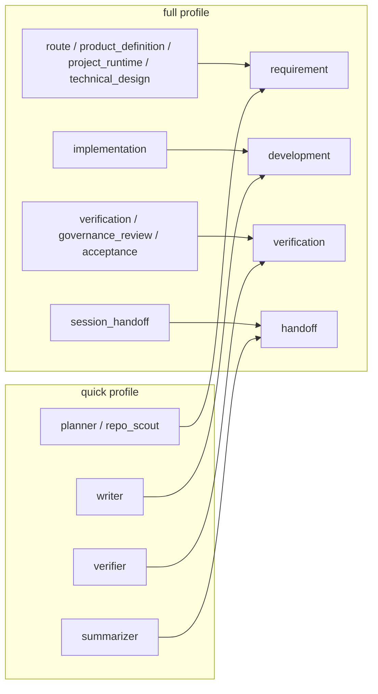

# Delivery / Execution Workflow Split

## Goal

AGT has two different state concerns:

- `delivery-workflow.json`: user-facing delivery lifecycle, from requirement to handoff.
- `execution-workflow.json`: AGT internal execution lifecycle, from profile steps to agent runs.

The execution workflow is the source of AGT step facts. The delivery workflow is a projection derived from execution facts. Delivery never writes back into execution.

## Flow



## State Files

### `session.json`

Session identity and index-level state.

Key fields:

- `session_id`: stable id for this run.
- `request`: normalized request text passed into AGT.
- `request_sources[]`: source files read by `--from` or `--from-dir`, with `type`, `path`, `sha256`, and `bytes`.
- `profile`: `full`, `quick`, or `investigate`; default is `full`.
- `status`: same as `delivery_status`, for list/index compatibility inside the current JS runtime.
- `delivery_status`: outer delivery status.
- `execution_status`: inner AGT execution status.
- `current_phase`: delivery phase shown to users.
- `current_stage`: execution stage shown for debugging.
- `source`: `new` or `migrated`.
- `prompt_trace_ids[]`: prompt traces associated with this session.
- `worktree`: optional task worktree metadata.

### `execution-workflow.json`

AGT internal workflow. This file answers: "what did AGT run?"

Key fields:

- `profile`: selected profile.
- `status`: execution status.
- `current_stage`: active or latest AGT step.
- `steps[]`: execution steps with `role`, `status`, `agent_run_id`, `prompt_trace_id`, `artifact_path`, `files_changed`, `commands_run`, and `summary`.
- `blocked_reason`: detailed internal failure reason.
- `files_changed[]`: aggregate observed changed files.
- `commands_run[]`: aggregate observed commands.

### `delivery-workflow.json`

User-facing delivery workflow. This file answers: "where is the requirement delivery blocked?"

Key fields:

- `status`: outer delivery status.
- `current_phase`: one of `requirement`, `development`, `verification`, `handoff`.
- `phases[]`: per-phase status, summary, blockers, and evidence refs.
- `blockers[]`: open blockers projected from failed execution steps.
- `evidence_refs[]`: prompts, agent runs, artifacts, files, commands, or events that explain the phase state.
- `summary`: user-facing summary for CLI/server.

## Phase Mapping



## Status Rules

- Execution step starts or completes.
- `RuntimeStore.updateExecutionWorkflow()` writes `execution-workflow.json`.
- The projector reads the updated execution workflow and writes `delivery-workflow.json`.
- The session index is updated from delivery status and current phase.
- CLI/server read delivery first, execution second.
- Execution can surface blockers into delivery through `blocked_reason`, step status, evidence refs, and runtime events.
- Delivery cannot directly mutate execution.

## CLI Contract

Default `agt status` output is delivery-first:

```text
delivery_status: blocked
current_phase: verification
phases:
  requirement: passed
  development: passed
  verification: blocked
  handoff: pending
blockers:
  verification/verification: Executor timed out after 900 seconds.
execution_status: blocked
runtime_status: timeout
current_stage: verification
```

`agt inspect <session-id>` prints the full state bundle:

- `session`
- `delivery_workflow`
- `execution_workflow`
- `prompts`
- `artifacts`
- `agent_runs`
- `tool_calls`

## Examples

### Complex CrewPals Feature

Full profile runs requirement alignment, implementation, verification, acceptance, and handoff. If implementation and verification pass but handoff evidence is missing:

- `delivery.current_phase = handoff`
- `delivery.status = blocked`
- `delivery.phases.requirement = passed`
- `delivery.phases.development = passed`
- `delivery.phases.verification = passed`
- `delivery.phases.handoff = blocked`
- `execution.current_stage = session_handoff`

The user sees "handoff blocked" instead of a generic workflow blocked state.

### Simple Backend Bugfix

Quick profile maps:

- `planner + repo_scout` to requirement.
- `writer` to development.
- `verifier` to verification.
- `summarizer` to handoff.

If `writer` blocks:

- `delivery.current_phase = development`
- `delivery.status = blocked`
- `verification` and `handoff` remain pending.
- `execution.current_stage = writer`

The user sees that coding is blocked, not that the whole requirement is undefined.
