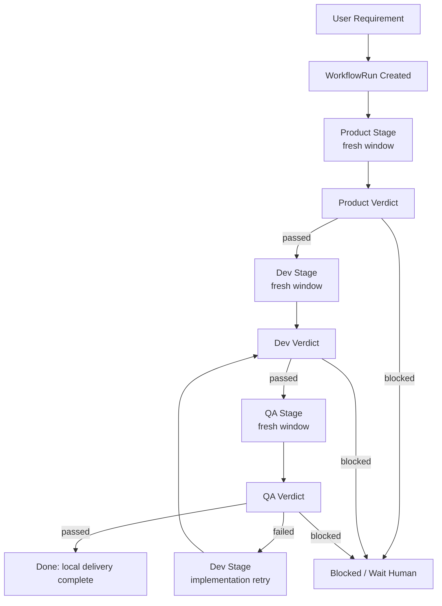
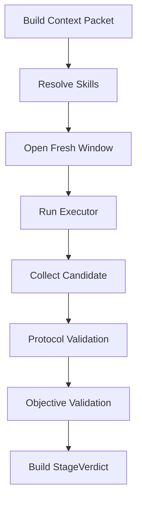

# Product -> Dev -> QA Workflow Runtime 技术方案

Date: 2026-06-21

## 1. 背景

当前 `agent-team-runtime` 已经解决了一部分“可追踪执行”的问题，但在产品层面还有三个核心缺口：

1. 状态没有清晰分层，用户看到的交付状态、runtime 内部执行状态、单次模型运行状态混在一起。
2. 角色边界不稳定，很多约束仍然靠一段长 prompt 记忆，导致阶段之间容易串上下文。
3. token 消耗偏高，同一个需求在多轮执行里反复重放聊天历史、仓库上下文和阶段说明。

这会直接带来两个后果：

- 用户很难把 AGT 当成稳定的“交付协议层”，而更像一个复杂的 agent prompt 包装。
- 当需求从实现走到验证时，缺少一个真正独立的 QA 闭环，很多边界 case 和服务端副作用只能靠人工补救。

这份方案的目标，是把 AGT 收敛成一套更清晰的 P0 工作流 runtime：

```text
Product -> Dev -> QA
```

其中：

- `Product` 负责把原始需求收敛成可执行合同。
- `Dev` 负责在隔离环境内改代码并提交自测证据。
- `QA` 负责独立验证，并给出最终的本地完成结论。

每个需求创建后，runtime 先让模型生成一份初始需求摘要。这个摘要不是人工写，也不替代 PRD，只负责把原始输入压缩成 Product 可以消费的起点。

`Acceptance` 不再作为 P0 的独立 stage。P0 的完成定义就是：

> 本地代码改完 + 测试/验证报告完整。

## 2. 产品定位

AGT 不是为了替代 Codex `/goal`、Claude Code 或 OpenAI Agent 这种强执行器。

AGT 的定位是：

> 面向 AI 研发交付的 workflow runtime。

它负责回答的不是“模型能不能写出来”，而是：

- 一个需求应该经过哪些阶段；
- 每个阶段要拿到什么输入；
- 每个阶段允许做什么、不允许做什么；
- 哪些产物必须结构化落盘；
- 什么时候允许进入下一阶段；
- 什么时候失败后回到 Dev、阻塞或等人判断。

因此可以把关系理解为：

- `/goal` 是研发执行层；
- AGT 是交付协议层。

执行器可以替换，workflow 不应该靠聊天习惯反复重建。

## 3. Layer 1 产品定义

按五层模型，这里的 Layer 1 只定义稳定产品语义，不绑定当前实现。

### 3.1 核心定义

- AGT 是一个可扩展的 AI 研发交付 workflow runtime。
- AGT 的核心目标是把需求交付流程协议化、状态化、证据化。
- AGT 的 P0 默认 workflow 是 `Product -> Dev -> QA`。
- AGT 的完成结论是“本地是否完成”，不是“是否已经 PR / merge / release”。
- AGT 的角色能力通过 `skill + project role markdown` 组合维护，而不是靠一次性 prompt。
- AGT 的阶段执行必须是 fresh window，禁止把上一个阶段的完整聊天上下文直接带入下一个阶段。

### 3.2 核心对象

| 对象 | 含义 |
| --- | --- |
| `workflow` | 一个需求的交付路径定义 |
| `role` | 某个阶段的责任边界，例如 Product / Dev / QA |
| `skill` | 角色可注入、可维护、可替换的能力说明 |
| `context_packet` | runtime 为某个阶段构建的最小输入包 |
| `artifact` | 阶段产物，例如需求合同、实现报告、QA 报告 |
| `handoff_summary` | 阶段交接摘要，例如 Product 给 Dev、Dev 给 QA 的最小交接信息 |
| `evidence` | 支撑结论的命令、diff、日志、接口结果、截图、文件 |
| `executor` | 被 AGT 调用的执行器，例如 Codex `/goal`、OpenAI Agents SDK、Claude Code |
| `state` | runtime 维护的机器可读状态 |
| `verdict` | runtime 对阶段结果的结构化判断 |

### 3.3 P0 边界

P0 只覆盖“本地交付到可验收”的闭环，明确包括：

- 需求边界定义
- 本地 worktree / branch 隔离
- 代码改动
- 自测记录
- 独立 QA 验证
- 验证证据落盘

P0 明确不承诺：

- PR / merge / release
- 线上事故排查
- CST 闭环
- 重型长期记忆系统
- 通用无限自主 loop

## 4. 从 loop 工程里借什么，不借什么

AGT 的 workflow 本质上是 loop，但不是“同一个 agent 在长上下文里不断自我反思”的那种泛化 loop。

合理的借鉴点只有四类：

1. **状态机**：每一步能去哪里，由 runtime 决定。
2. **失败回路**：QA 失败时，把结构化问题写入 QA 报告，并回到 Dev 实现。
3. **停止条件**：达到通过、阻塞、人工介入、超出最大尝试次数时立即停。
4. **预算控制**：上下文、轮次、可调用工具、写权限都要有限制。

AGT 不借鉴的部分是：

- 让同一个长会话无限增长；
- 让模型自己决定状态 key；
- 让模型决定是否跳过验证；
- 让“我觉得好了”直接等于 workflow 通过。

因此，AGT 应该做的是 **受控 loop**，不是 **开放式自治 loop**。

## 5. 总体架构



这个架构有两个关键原则：

1. **外层 workflow 控制内层模型执行**。
2. **状态机只消费 runtime 验证后的 verdict，不消费 raw model output**。

## 5.1 全环节可审计是硬约束

这套 workflow 如果不可审计，后续所有“为什么过了 / 为什么没过 / 为什么又回到 Dev / 为什么 token 高”都会重新掉回聊天解释，runtime 就失去意义。

因此 P0 必须把 **全环节可审计** 作为硬约束，而不是可选增强。

这里的“全环节”至少包括：

- 原始需求输入
- Product / Dev / QA 每一轮 stage 的输入包
- 该轮引用了哪个项目级 skill manifest，以及对应 role markdown / workflow policy 的版本或 hash
- 实际发送给 executor 的 prompt 或 stdin
- executor 返回的 candidate、tool call、命令执行和摘要
- runtime 生成的 `StageVerdict`
- 外层状态流转前后快照
- QA failed 的问题摘要和证据引用
- 人工决策、人工补充上下文和人工中断

只要某个关键结论不能追溯到上述证据之一，就不算“可审计”。

### 5.1.1 审计目标

任何一次 run，后续都应该能回答下面这些问题：

1. 这一轮为什么进入了当前 stage？
2. 当前 stage 到底看到了什么输入？
3. 本轮引用了哪个项目级 skill manifest、来自哪里、版本是什么？
4. executor 实际收到了什么 prompt？
5. 它运行过程中做了什么命令 / tool call？
6. 它交回了什么 candidate？
7. runtime 为什么判定 passed / failed / blocked？
8. 如果 QA failed 后回到 Dev，问题是由谁提出、基于什么证据提出的？
9. 如果有人为介入，介入发生在何时、改了什么决策？

### 5.1.2 审计设计原则

1. **先落盘，后总结**
   - 所有影响结论的原始证据先写入结构化文件，再由 CLI / UI 做摘要。

2. **机器控制和人类文档分离**
   - 状态、契约、项目级 skill manifest、prompt trace、verdict 用 JSON/YAML。
   - Product / Dev / QA 报告可用 Markdown。

3. **结论必须可回放**
   - 任一阶段的通过或失败，都必须能顺着 `input -> prompt -> candidate -> verdict -> state transition` 回放。

4. **审计字段由 runtime 拥有**
   - 不让模型自由发明会影响审计的 key。

5. **人工动作也要可审计**
   - 人工补充范围、手工放行、手工中断、手工覆盖判断，都必须留下事件和原因。

## 6. 两层状态模型

这是这次方案最重要的结构调整。

### 6.1 外层：`WorkflowRun`

外层状态是用户关心的交付状态，回答的是：

> 这个需求现在卡在哪个业务阶段，是否已经本地完成？

建议状态：

| 状态 | 含义 |
| --- | --- |
| `created` | session 已创建，尚未开始 |
| `running` | 当前有 stage 正在执行 |
| `waiting_human` | 需要人工 check / 对齐 / 提供外部条件 |
| `done` | 本地交付完成 |
| `blocked` | 当前无法继续推进 |
| `cancelled` | 人工终止 |

外层字段建议：

```json
{
  "workflow_run_id": "wr_20260621_001",
  "workflow_id": "product-dev-qa",
  "status": "running",
  "current_role": "dev",
  "current_step": "implementation",
  "waiting_on": null,
  "started_at": "2026-06-21T10:00:00+08:00",
  "updated_at": "2026-06-21T10:12:00+08:00",
  "final_verdict": null
}
```

### 6.2 内层：`StageRun`

内层状态是 runtime 和调试关心的执行状态，回答的是：

> 这个角色这一轮到底收到了什么输入、调用了谁、产出了什么、为什么通过或失败？

建议状态：

| 状态 | 含义 |
| --- | --- |
| `prepared` | context packet、技能包、权限已准备好 |
| `running` | 执行器正在运行 |
| `submitted` | 执行器已返回 candidate |
| `validated` | runtime 已完成协议和客观校验 |
| `passed` | 本轮通过 |
| `failed` | 本轮失败，状态机按规则进入下一步 |
| `blocked` | 本轮阻塞，无法自动继续 |

内层字段建议：

```json
{
  "stage_run_id": "sr_dev_002",
  "workflow_run_id": "wr_20260621_001",
  "role": "dev",
  "attempt": 2,
  "status": "validated",
  "context_packet_path": ".agt2/sessions/.../stages/dev/attempt-002/context-packet.json",
  "prompt_trace_path": ".agt2/sessions/.../stages/dev/attempt-002/prompt.md",
  "candidate_path": ".agt2/sessions/.../stages/dev/attempt-002/candidate.json",
  "verdict_path": ".agt2/sessions/.../stages/dev/attempt-002/verdict.json"
}
```

### 6.3 状态分层原则

- 外层 `WorkflowRun` 不直接保存模型输出内容。
- 内层 `StageRun` 不直接推进业务状态。
- 只有 runtime 生成的 `StageVerdict` 能推动外层状态流转。

额外增加一条审计原则：

- 外层和内层状态都必须保存足够的 trace 指针，保证任何状态变化都能反查到对应证据。

这就是“状态分层，内外部区分”的核心落点。

### 6.4 P0 状态机流转方案

P0 先保持简单：外层 `WorkflowRun.status` 只表达大状态，当前跑到哪个角色用 `current_role` 表达；Dev 内部用 `current_step` 区分技术方案和实现。

```text
created
  -> running(intake_summary)
  -> running(product)
  -> waiting_human(product_check)
  -> running(dev:technical_plan)
  -> waiting_human(dev_plan_check)
  -> running(dev:implementation)
  -> running(qa)
  -> done
```

如果中间出问题，只走三类分支：

```text
Product blocked -> waiting_human
Dev blocked     -> waiting_human
QA failed       -> running(dev:implementation)
QA blocked      -> waiting_human
```

P0 只有两个固定人工 gate：

- `product_check`：Product 合同写完后，需要人确认 PRD / 需求合同是否准确。
- `dev_plan_check`：Dev 技术方案写完后，需要人对齐实现路径、改动范围和测试策略。

Dev 实现完成后不再等待人工 check，直接进入 QA。实现过程中如果存在歧义，Dev 必须把歧义写入结构化产物；阻塞型歧义进入 `waiting_human`，非阻塞型歧义可以按明确假设继续实现，但最终必须回报给用户。

状态机不直接读模型输出。每个 stage 返回后，runtime 先生成 `StageVerdict`，再按下面的规则流转：

| 当前角色 | Verdict | 下一状态 | 动作 |
| --- | --- | --- | --- |
| `intake_summary` | `passed` | `running(product)` | 模型生成 `request-summary.md` |
| `product` | `passed` | `waiting_human(product_check)` | 产出待确认的 `product-contract.md` 和 `product-handoff.md` |
| `product` | `blocked` | `waiting_human` | 记录缺失问题，等待人工补充需求 |
| `human product_check` | `approved` | `running(dev:technical_plan)` | 固化 `product-contract.md` / `product-handoff.md`，生成 Dev 技术方案输入包 |
| `human product_check` | `changes_requested` | `running(product)` | 带人工反馈重跑 Product |
| `dev:technical_plan` | `passed` | `waiting_human(dev_plan_check)` | 产出待对齐的 `technical-plan.md` |
| `human dev_plan_check` | `approved` | `running(dev:implementation)` | 固化 `technical-plan.md`，生成 Dev 实现输入包 |
| `human dev_plan_check` | `changes_requested` | `running(dev:technical_plan)` | 带人工反馈重跑 Dev 技术方案 |
| `dev:implementation` | `passed` | `running(qa)` | 固化实现产物和 `qa-handoff.md`，生成 QA 的 `context-packet.json`，不再人工 check |
| `dev` | `blocked` | `waiting_human` | 记录阻塞原因，等待人工处理环境、依赖或范围问题 |
| `qa` | `passed` | `done` | 固化 `qa-report.md` 和最终本地完成结论 |
| `qa` | `failed` | `running(dev:implementation)` | 固化 `qa-report.md` 中的问题和证据引用，再进入 Dev 实现 |
| `qa` | `blocked` | `waiting_human` | 记录无法验证的原因和未验证项 |

这里的 PRD 在 P0 里不再单独做一份重文档，统一叫 `product-contract.md`。它是 Product 阶段的主产物，也是 Dev 和 QA 的需求事实来源。

### 6.4.1 阶段交接规则

每次交接都必须由上一阶段执行完成后触发：

- 需求进入 workflow 后，模型先生成 `request-summary.md`，再进入 Product。
- Product 产出并经人工确认后，`product-contract.md` 和 `product-handoff.md` 交给 Dev。
- Dev 技术方案经人工确认后，`technical-plan.md` 交给 Dev implementation。
- Dev implementation 完成后，`implementation-report.md`、`self-test-report.md`、`implementation-ambiguities.json` 和 `qa-handoff.md` 交给 QA。

这些交接摘要只负责降低下游阅读成本，不替代主产物。runtime 不把上一个阶段的完整聊天历史直接传给下一个阶段。

Workflow 创建后，runtime 先做一步轻量摘要：

1. 基于用户原始需求生成 `request-summary.md`。
2. 摘要只保留目标、范围线索、约束、疑问点，不做设计和实现决策。
3. Product 阶段默认消费 `user_request + request-summary.md`，而不是直接重放完整聊天历史。

Product 产出给 Dev 的时机是：

1. Product 执行器产出 `product-contract.md`。
2. Product 同时产出 `product-handoff.md`，用 5-10 行总结 Dev 接下来需要知道什么。
3. runtime 校验 `product-contract.md` 至少包含 `目标`、`范围内`、`暂不做`、`验收标准`、`QA 重点验证点`。
4. runtime 生成 `Product StageVerdict.passed`，进入 `waiting_human(product_check)`。
5. 人工确认通过后，runtime 写入封版的 `artifacts/product-contract.md` 和 `artifacts/product-handoff.md`，记录 `content_sha256`。
6. runtime 生成 Dev 技术方案的 `context-packet.json`，里面引用这份已封版合同和交接摘要：

```json
{
  "role": "dev",
  "input_artifacts": [
    {
      "name": "request-summary.md",
      "path": "artifacts/request-summary.md",
      "content_sha256": "..."
    },
    {
      "name": "product-contract.md",
      "path": "artifacts/product-contract.md",
      "content_sha256": "..."
    },
    {
      "name": "product-handoff.md",
      "path": "artifacts/product-handoff.md",
      "content_sha256": "..."
    }
  ],
  "goal": "Draft a technical plan for the sealed product contract."
}
```

也就是说，Dev 不直接读取 Product 阶段的完整聊天记录，也不读取 Product 的草稿。Dev 的输入是 `request-summary.md + product-contract.md + product-handoff.md`。只有 Product 通过 runtime 校验并经过人工 check 后，Dev 才能开始写技术方案。

Dev 技术方案对齐后才允许实现：

1. Dev 先产出 `technical-plan.md`，列出实现路径、改动范围、测试策略和实现歧义点。
2. runtime 校验技术方案存在且包含实现计划、风险、测试计划。
3. runtime 进入 `waiting_human(dev_plan_check)`。
4. 人工确认通过后，runtime 固化 `artifacts/technical-plan.md`，生成 Dev 实现输入包。
5. Dev 实现完成时，额外生成 `qa-handoff.md`，总结 QA 该重点看什么、采用了哪些假设、哪些风险需要确认。
6. Dev 实现完成后直接进入 QA，不再等待人工 check。

如果 Dev 在技术方案或实现阶段发现实现歧义，必须写入 `implementation-ambiguities.json` 或 `technical-plan.md` 的“实现歧义 / Assumptions”小节。歧义分两类：

- 阻塞型：无法合理选择实现路径，进入 `waiting_human`。
- 非阻塞型：Dev 选择一个明确假设继续实现，但必须在最终汇总里回报给用户。

QA failed 时也一样，不把 QA 的完整上下文丢给 Dev，也不额外生成独立的失败包。QA 只需要把失败项和证据引用写入 `qa-report.md`：

```markdown
## Failed Items

- id: QA-001
  severity: high
  summary: Boundary input returns 500.
  evidence_refs:
    - artifacts/qa/curl-boundary.txt
```

Dev 下一轮输入就是：

- `request-summary.md`
- 已封版的 `product-contract.md`
- `product-handoff.md`
- 已对齐的 `technical-plan.md`
- 上一轮实现产物摘要
- `qa-report.md` 中的失败项和证据引用

这样状态流转保持简单，但每一次交接都有明确的 artifact 和 hash，可以审计。

## 7. 受控 loop 设计

### 7.1 外层 loop

外层 loop 可以写成固定的 runtime 过程：

1. 选择当前 role。
2. 构建该 role 的 fresh window 输入。
3. 调用 executor。
4. 收集 candidate、artifacts、evidence。
5. 生成 `StageVerdict`。
6. 由状态机决定：
   - 进入下一 stage；
   - 回到 Dev 实现；
   - 进入 `waiting_human`；
   - 进入 `done`；
   - 进入 `blocked`。

### 7.2 内层 stage loop

每个 stage 内部也有一个小 loop，但它只服务于当前角色，不允许跨角色污染状态。



### 7.3 Fresh Window Rule

这是 P0 的硬规则：

- 每个 role 的每次 attempt 都新开一个执行窗口。
- 只按项目级 skill manifest 解析当前 role 需要的 context packet 和 skills。
- 不把完整聊天历史直接传给下游 stage。
- 阶段之间只能通过结构化 artifacts、evidence 和 handoff summary 传递信息。

这样做的直接收益是：

- token 更可控；
- 角色边界清晰；
- QA 能真正独立；
- role 维护方式变成“改 skill / role md”，而不是“修一段超长 prompt”。

交接摘要把“事实来源”和“下游最小阅读成本”拆开：

- `request-summary.md` 负责压缩原始需求；
- `product-handoff.md` 负责 Product -> Dev 交接；
- `qa-handoff.md` 负责 Dev -> QA 交接。

同时它也天然提升审计性：

- 每个阶段都有独立 prompt；
- 每个阶段都记录所引用的项目级 skill manifest 版本；
- 每个阶段都有独立命令和输出边界；
- 不会因为共享长会话而混淆“这条结论到底是谁在什么上下文里得出的”。

## 8. 角色模型与 skill 组合

P0 的角色是固定三个，但 skill 组合必须是可扩展的。

### 8.1 项目级 skill manifest

P0 先不把 skill 注入做成每次执行的细颗粒度产物，而是以项目为单位维护一份粗粒度 manifest。

建议 source of truth：

```text
.agt2/project/skill-manifest.yaml
```

它定义项目默认 workflow，以及每个 role 默认使用哪些 global skill 和项目角色 markdown：

```yaml
schema_version: 1
default_workflow: product-dev-qa
roles:
  product:
    global_skills:
      - id: product-core
        source: builtin://roles/product-core
        version: "2026-06-21"
    project_role_md: .agt2/project/roles/product.md
  dev:
    global_skills:
      - id: dev-core
        source: builtin://roles/dev-core
        version: "2026-06-21"
    project_role_md: .agt2/project/roles/dev.md
  qa:
    global_skills:
      - id: qa-core
        source: builtin://roles/qa-core
        version: "2026-06-21"
    project_role_md: .agt2/project/roles/qa.md
```

这样维护角色能力时，优先改项目级 manifest 和 role markdown，而不是改每次 run 的注入清单。

### 8.2 stage 输入组合顺序

建议每个 stage 的最终提示输入由四层组成：

1. **项目级 skill manifest**
   - 例如 `.agt2/project/skill-manifest.yaml`，定义本项目每个 role 的默认能力组合。
2. **全局角色 skill**
   - 例如 `product`, `dev`, `qa` 的稳定职责定义。
3. **项目角色 markdown**
   - 例如 `.agt2/project/roles/product.md`
   - 用来放该项目重复出现的边界、坑点、约束。
4. **项目级 workflow contract**
   - 例如 `.agt2/project/workflows/product-dev-qa.yaml`，定义状态机、阶段输入输出和失败回路。
5. **runtime 生成的 context packet**
   - 当前任务的最小上下文、输入产物、允许动作、必须输出。

顺序上，越往后越具体，优先级越高。

为了满足审计要求，每次 stage 运行不复制完整 skill 清单，只记录项目级 manifest 的引用，例如：

```json
{
  "role": "qa",
  "skill_manifest_ref": {
    "path": ".agt2/project/skill-manifest.yaml",
    "content_sha256": "...",
    "role": "qa"
  },
  "role_context_refs": [
    {
      "kind": "project_role_md",
      "path": ".agt2/project/roles/qa.md",
      "content_sha256": "..."
    },
    {
      "kind": "workflow_contract",
      "path": ".agt2/project/workflows/product-dev-qa.yaml",
      "selector": "stages.qa",
      "content_sha256": "..."
    }
  ]
}
```

后续如果 QA 判错或放过了问题，先看项目级 manifest 和角色 markdown 是否需要调整；只有当项目级配置无误，才继续追 executor 推理问题。

### 8.3 建议目录

```text
.agt2/
  project/
    skill-manifest.yaml
    roles/
      product.md
      dev.md
      qa.md
    workflows/
      product-dev-qa.yaml
```

全局 skill 可以来自 runtime 内置目录或外部 skill 仓库；项目级 manifest 定义“本项目默认怎么组合角色能力”；项目角色 markdown 是项目自己的轻量长期记忆。

### 8.4 轻量项目记忆策略

P0 不做重型 memory 系统，只做轻量 project memory：

- QA 发现某类项目级问题反复发生；
- runtime 在报告里给出“建议写入角色文件”的条目；
- 人工确认后，把经验补到 `.agt2/project/roles/*.md`。

例如：

- `qa.md` 里写“服务端需求必须启动服务、本地读日志、必要时校验数据库和 curl 回归”。
- `dev.md` 里写“修改接口响应时必须同步更新 DTO 和 contract test”。

这样下一次执行天然会注入，不需要做复杂知识库。

## 9. 三个阶段的责任定义

### 9.1 Product

`Product` 不写代码。它只做一件事：

> 把原始需求转换为可执行的任务合同。

输入：

- 用户原始需求
- `request-summary.md`
- 必要的仓库快照
- 项目 `product.md`

输出建议：

- `product-contract.md`
- `product-handoff.md`
- `scope.json`

`product-contract.md` 至少要定义：

- 目标
- 范围内
- 暂不做
- 验收标准
- 风险 / 未知项
- 需要 QA 特别验证的点

### 9.2 Dev

`Dev` 负责先给出技术方案并完成对齐，再把需求合同落到代码，并提交自测证据。

`Dev` 在 P0 仍然是一个 outer stage，不再拆成两个外层角色。但它内部有两个明确 step：

```text
technical_plan -> implementation -> self-test
```

`technical_plan` 完成后需要人工对齐；`implementation` 完成后直接进入 QA，不再人工 check。

输入：

- `request-summary.md`
- `product-contract.md`
- `product-handoff.md`
- 相关代码上下文
- 项目 `dev.md`

输出建议：

- `technical-plan.md`
- `implementation-report.md`
- `self-test-report.md`
- `implementation-ambiguities.json`
- `qa-handoff.md`

`technical-plan.md` 至少要包括：

- 实现路径
- 改动范围
- 关键风险
- 测试策略
- 实现歧义 / assumptions

`implementation-report.md` 至少要包括：

- 改动摘要
- 关键改动文件或模块
- 关键设计取舍
- 已运行的测试 / 命令
- 已知风险
- 建议 QA 重点回归的点
- 未阻塞实现但需要回报给用户的歧义点

`qa-handoff.md` 至少要包括：

- QA 重点验证点
- Dev 已采用的实现假设
- 需要关注的风险或边界
- 运行验证建议

### 9.3 QA

`QA` 是 P0 的核心价值，不是“再跑一次测试”。

`QA` 负责：

- 独立阅读 `product-contract.md`
- 独立检查 Dev 输出和代码改动
- 按场景执行验证
- 给出最终本地完成结论

输入：

- `request-summary.md`
- `product-contract.md`
- `product-handoff.md`
- `technical-plan.md`
- `implementation-report.md`
- `self-test-report.md`
- `implementation-ambiguities.json`
- `qa-handoff.md`
- 项目 `qa.md`

输出建议：

- `qa-report.md`
- `verification-evidence.json`

`QA` 是 P0 里唯一可以宣布 `local delivery complete` 的角色。

`qa-report.md` 必须包含：

- 最终本地完成结论；
- 已验证项和证据引用；
- 未验证项；
- QA failed 时发现的问题项和证据引用；
- Dev 实现阶段留下的非阻塞实现歧义和采用的假设。

## 10. QA 深验证设计

这部分决定 AGT 是否真的有价值。

### 10.1 QA 不只是 test runner

QA 必须覆盖四类检查：

1. **需求对齐**
   - 范围内功能是否实现；
   - 暂不做项是否被误改；
   - 是否满足验收标准。

2. **回归与边界**
   - 边界输入；
   - 空值 / 异常路径；
   - 兼容性；
   - 隐藏副作用。

3. **运行态验证**
   - 服务是否能启动；
   - 关键日志是否正常；
   - 目标接口是否真实可调；
   - 关键依赖是否工作。

4. **证据质量**
   - Dev 自测是否真的跑过；
   - 证据是否足以支撑结论；
   - 是否有未验证项。

### 10.2 服务端需求的 QA 基线

对于 backend / service-side 需求，建议 QA skill 默认要求：

- 启动服务；
- 读取本地日志；
- 必要时检查数据库读路径；
- 必要时检查缓存或外部依赖；
- 用 `curl` / API client 做真实调用；
- 覆盖一个 happy path 和若干边界 case。

典型验证项：

| 类别 | 最低要求 |
| --- | --- |
| 服务启动 | 能正常启动，无新增启动错误 |
| 数据库 | 关键读链路正确，必要时做只读校验 |
| 日志 | 无明显异常日志，关键路径有可观察证据 |
| API | 主路径可用，状态码/字段符合预期 |
| 边界 case | 至少覆盖 1 个失败路径或边界输入 |
| 副作用 | 不引入明显兼容性或数据污染风险 |

### 10.3 QA 失败如何返回 Dev

QA 失败时，不能只给一句“没过”。

QA 必须把失败项写进 `qa-report.md`，例如：

```markdown
## Failed Items

- id: QA-001
  severity: high
  summary: empty user_id returns 500 instead of 400
  evidence_refs:
    - artifacts/qa/curl-empty-user.txt
    - artifacts/qa/server-log-snippet.txt
  suggested_fix_scope: request validation
```

Dev 下一轮只能消费 `qa-report.md` 里的失败项、证据引用和必要上游产物，不应该带着整个 QA 聊天记录继续跑。

## 11. token 与上下文控制策略

这套设计能降低 token，关键不在“模型更聪明”，而在“输入变短且稳定”。

### 11.1 最小上下文包

每个 stage 只拿四类内容：

1. 当前 role 的 skill 组合；
2. 该 role 必需的上游 artifacts；
3. 仓库快照摘要；
4. runtime 生成的 contract / constraints。

不传：

- 全量聊天历史；
- 不相关 stage 的原始输出；
- 整个仓库的无差别扫描结果；
- 重复的说明性 prompt。

### 11.2 可缓存的项目快照

建议 runtime 维护一个可复用的 `project-snapshot.json`，包括：

- repo root
- branch / worktree 信息
- 主要语言 / 包管理器
- 测试入口
- 启动命令
- 关键目录

这样 Product、Dev、QA 不需要每轮都重新做全仓库归纳。

### 11.3 结构化产物替代聊天记忆

如果一个信息已经进入：

- `product-contract.md`
- `implementation-report.md`
- `self-test-report.md`
- `qa-report.md`

那它就不应该再通过“重放聊天历史”传递。

## 12. Protocol-owned contract

这部分沿用仓库已有原则：

> runtime 拥有协议结构；模型只填充内容值。

### 12.1 模型输出不是最终状态

执行器返回的是 `StageCandidate`，不是最终状态。

runtime 负责：

- schema 校验
- required artifact 校验
- required evidence 校验
- result slot 校验
- 语义 / 治理判断

然后生成 `StageVerdict`。

### 12.2 `StageVerdict` 建议结构

```json
{
  "role": "qa",
  "attempt": 1,
  "verdict": {
    "passed": null,
    "failed": {
      "reason": "Boundary case failed",
      "next": "dev.implementation",
      "failed_item_ids": ["QA-001"]
    },
    "blocked": null
  }
}
```

要求：

- `passed` / `failed` / `blocked` 三个槽位必须且只能有一个非空。
- 只有 `StageVerdict` 能驱动状态机。
- 协议错误和任务失败必须分开报告。

### 12.3 审计账本字段

每个 `StageRun` 至少要有下面这些可审计字段：

```json
{
  "stage_run_id": "sr_qa_001",
  "role": "qa",
  "attempt": 1,
  "input_artifact_refs": [
    "artifacts/request-summary.md",
    "artifacts/product-contract.md",
    "artifacts/product-handoff.md",
    "artifacts/technical-plan.md",
    "artifacts/implementation-report.md",
    "artifacts/qa-handoff.md"
  ],
  "skill_manifest_ref": {
    "path": ".agt2/project/skill-manifest.yaml",
    "content_sha256": "...",
    "role": "qa"
  },
  "context_packet_path": "stages/qa/attempt-001/context-packet.json",
  "prompt_trace_path": "stages/qa/attempt-001/prompt.md",
  "executor_run_path": "stages/qa/attempt-001/executor-run.json",
  "candidate_path": "stages/qa/attempt-001/candidate.json",
  "verdict_path": "stages/qa/attempt-001/verdict.json",
  "pre_state_path": "stages/qa/attempt-001/pre-state.json",
  "post_state_path": "stages/qa/attempt-001/post-state.json"
}
```

如果缺少其中任意关键项，这一轮 run 就不满足“可审计完成”。

## 13. 核心配置与数据模型建议

### 13.1 `WorkflowSpec`

P0 的 `product-dev-qa.yaml` 保持简单，只定义状态机、阶段输入输出、失败回路和完成条件。它不放长 prompt，也不放角色长期经验。

```yaml
schema_version: 1
workflow_id: product-dev-qa

entry: intake_summary

stages:
  intake_summary:
    can_write_code: false
    required_inputs:
      - user_request
      - project_snapshot
    required_outputs:
      - request-summary.md
    required_evidence:
      - request_summary_generated
    next:
      passed: product
      blocked: waiting_human

  product:
    can_write_code: false
    required_inputs:
      - request-summary.md
      - user_request
      - project_snapshot
    required_outputs:
      - product-contract.md
      - product-handoff.md
    required_evidence:
      - scope_defined
      - acceptance_criteria_defined
      - qa_focus_defined
    next:
      passed: product_check
      blocked: waiting_human

  dev:
    required_inputs:
      - request-summary.md
      - product-contract.md
      - product-handoff.md
    steps:
      technical_plan:
        can_write_code: false
        required_outputs:
          - technical-plan.md
        required_evidence:
          - implementation_plan_defined
          - test_strategy_defined
          - implementation_ambiguities_declared
        next:
          passed: dev_plan_check
          blocked: waiting_human

      implementation:
        can_write_code: true
        required_inputs:
          - request-summary.md
          - product-contract.md
          - product-handoff.md
          - technical-plan.md
        required_outputs:
          - implementation-report.md
          - self-test-report.md
          - implementation-ambiguities.json
          - qa-handoff.md
        required_evidence:
          - code_changed
          - self_tests_recorded
          - implementation_ambiguities_declared
        next:
          passed: qa
          blocked: waiting_human

  qa:
    can_write_code: false
    required_inputs:
      - request-summary.md
      - product-contract.md
      - product-handoff.md
      - technical-plan.md
      - implementation-report.md
      - self-test-report.md
      - implementation-ambiguities.json
      - qa-handoff.md
    required_outputs:
      - qa-report.md
      - verification-evidence.json
    required_evidence:
      - independent_verification
      - unverified_items_declared
    next:
      passed: done
      failed: dev.implementation
      blocked: waiting_human

human_gates:
  product_check:
    after: product
    approve_next: dev.technical_plan
    changes_requested_next: product

  dev_plan_check:
    after: dev.technical_plan
    approve_next: dev.implementation
    changes_requested_next: dev.technical_plan

completion:
  final_role: qa
  final_verdict: passed
  include_final_report_sections:
    - verification_summary
    - implementation_ambiguities
    - unverified_items
```

其中 Product 的 `required_evidence` 三个字段含义是：

- `scope_defined`：范围已定义，包含范围内和暂不做。
- `acceptance_criteria_defined`：验收标准已定义。
- `qa_focus_defined`：QA 重点验证点已定义，也就是 Product 明确告诉 QA 后续要重点验证哪些边界、运行态或副作用。

这个配置只管流程契约。Dev 的长期行为准则仍然放在 `.agt2/project/roles/dev.md`，QA 的深验证习惯仍然放在 `.agt2/project/roles/qa.md`。

### 13.2 `ContextPacket`

```json
{
  "workflow_run_id": "wr_20260621_001",
  "role": "qa",
  "goal": "Verify whether local delivery is complete",
  "input_artifacts": [
    "request-summary.md",
    "product-contract.md",
    "product-handoff.md",
    "technical-plan.md",
    "implementation-report.md",
    "self-test-report.md",
    "implementation-ambiguities.json",
    "qa-handoff.md"
  ],
  "skill_manifest_ref": {
    "path": ".agt2/project/skill-manifest.yaml",
    "content_sha256": "...",
    "role": "qa"
  },
  "workflow_contract_ref": {
    "path": ".agt2/project/workflows/product-dev-qa.yaml",
    "content_sha256": "...",
    "stage": "qa"
  },
  "constraints": {
    "can_write_code": false,
    "must_produce_verdict": true
  }
}
```

## 14. 目录与落盘布局

建议在当前 `.agt2` 基础上收敛到更明确的 session 结构：

```text
.agt2/
  project/
    skill-manifest.yaml
    roles/
      product.md
      dev.md
      qa.md
    workflows/
      product-dev-qa.yaml
  sessions/
    <workflow_run_id>/
      workflow-run.json
      events.jsonl
      project-snapshot.json
      artifacts/
        request-summary.md
        product-contract.md
        product-handoff.md
        technical-plan.md
        implementation-report.md
        self-test-report.md
        implementation-ambiguities.json
        qa-handoff.md
        qa-report.md
        verification-evidence.json
      stages/
        intake_summary/
          attempt-001/
            context-packet.json
            pre-state.json
            prompt.md
            prompt.meta.json
            candidate.json
            verdict.json
            executor-run.json
            post-state.json
        product/
          attempt-001/
            context-packet.json
            pre-state.json
            prompt.md
            prompt.meta.json
            candidate.json
            verdict.json
            executor-run.json
            post-state.json
        dev/
          technical-plan/
            attempt-001/
              context-packet.json
              pre-state.json
              prompt.md
              prompt.meta.json
              candidate.json
              verdict.json
              executor-run.json
              post-state.json
          implementation/
            attempt-001/
              context-packet.json
              pre-state.json
              prompt.md
              prompt.meta.json
              candidate.json
              verdict.json
              executor-run.json
              post-state.json
        qa/
          attempt-001/
            context-packet.json
            pre-state.json
            prompt.md
            prompt.meta.json
            candidate.json
            verdict.json
            executor-run.json
            post-state.json
```

这个布局有四个目的：

1. 用户直接看 `workflow-run.json` 就知道卡在哪；
2. 调试时能顺着 `stages/*/attempt-*` 找完整 trace；
3. artifacts 和 trace 分开，避免“机器状态”和“人类文档”混杂；
4. QA failed 后回到 Dev 实现时会生成新的 attempt，可追踪失败修复链路。

如果要支持真正的全环节可审计，建议再补一个统一事件账本：

```text
.agt2/sessions/<workflow_run_id>/events.jsonl
```

每条事件至少包含：

- `ts`
- `kind`
- `workflow_run_id`
- `stage_run_id`
- `role`
- `summary`
- `evidence_refs`

典型事件：

- `workflow_created`
- `stage_prepared`
- `skill_manifest_loaded`
- `prompt_written`
- `executor_started`
- `tool_call_recorded`
- `candidate_submitted`
- `verdict_written`
- `state_transitioned`
- `human_decision_recorded`

这样 CLI 或 UI 不需要猜过程，而是直接重建审计链路。

### 14.1 人工决策也必须落盘

很多 workflow 最后失真，不是因为模型没留 trace，而是因为人工口头改了边界、手工放过了问题、或者半路插入了额外要求，但没有进入系统。

因此人工动作也必须结构化记录，例如：

```json
{
  "decision_id": "hd_001",
  "kind": "human_scope_adjustment",
  "actor": "user",
  "stage": "product",
  "reason": "exclude release workflow from P0",
  "before": {
    "out_of_scope": []
  },
  "after": {
    "out_of_scope": ["PR", "merge", "release", "CST"]
  }
}
```

没有这层记录，后续就无法区分“模型理解错了”还是“人后来改了”。

### 14.2 审计查询能力

P0 虽然不一定马上做完整 UI，但至少要能通过 CLI 或 API 查下面这些问题：

- 当前 run 的所有 stage 和状态
- 某个 stage 的输入、项目级 skill manifest 引用、prompt、candidate、verdict
- 某个 failed item 是在哪一轮 QA 被提出的
- QA failed 后为什么回到 Dev 实现
- 哪些人工决策修改了原始合同

也就是说，审计不是“把文件存下来就算完”，还要能被查询和解释。

## 15. 执行器抽象

AGT 不应该绑定某一个 executor。

建议定义统一的 `ExecutorAdapter`：

| 字段 | 含义 |
| --- | --- |
| `name` | 执行器名称 |
| `open_window()` | 打开 fresh window |
| `run(context_packet, resolved_role_context)` | 执行当前 stage |
| `collect_trace()` | 收集 prompt、tool call、输出 |
| `close_window()` | 结束当前 stage 会话 |

P0 可以先继续复用当前的 OpenAI Agents SDK / local fallback runner，只要接口是适配层而不是业务层即可。

后续要接：

- Codex `/goal`
- Claude Code
- 其他 agent runtime

都应该只改 `ExecutorAdapter`，不改 workflow 核心状态机。

## 16. P0 落地路线

建议按以下顺序实现：

### 第 1 步：先收敛产品与状态模型

- 固定 P0 workflow 为 `Product -> Dev -> QA`
- 去掉独立 `Acceptance` stage
- 定义 `WorkflowRun` / `StageRun` / `StageVerdict` schema

### 第 2 步：实现 fresh window stage runner

- 每个 stage 新开执行窗口
- 按项目级 skill manifest 解析 role context
- 落盘 `context-packet`、`prompt`、`candidate`、`verdict`
- 在 `context-packet` / `prompt.meta` 里记录项目级 skill manifest 引用和 hash
- 落盘 `executor-run`、前后状态快照

### 第 3 步：实现 Product / Dev / QA 三个基础 role

- Product 只产出 `product-contract.md`
- Dev 先产出 `technical-plan.md` 并等待人工对齐
- Dev 实现完成后产出实现、自测证据和 `implementation-ambiguities.json`，直接进入 QA
- QA 产出最终本地验证报告，并汇总未验证项和非阻塞实现歧义

### 第 4 步：实现 QA failed -> Dev implementation 回路

- QA `failed` 时固化 `qa-report.md` 的 failed items
- Dev 下一轮只读取 failed items、证据引用和必要上游产物
- 增加最大 QA failed 回路次数，避免无限循环

### 第 5 步：补 project role markdown

- 支持 `.agt2/project/skill-manifest.yaml`
- 支持 `.agt2/project/roles/*.md`
- 支持人工把重复问题沉淀进去

### 第 6 步：补控制台视图

- workflow 总览
- stage attempt trace
- artifacts / evidence 预览
- 当前阻塞原因
- 审计查询入口：项目级 skill manifest、prompt、人工决策、QA failed 回路

## 17. 风险与取舍

### 17.1 风险

1. Product 合同如果写得太泛，后续 Dev / QA 仍然会跑偏。
2. QA 如果只是测试搬运工，这套流程会失去价值。
3. fresh window 会增加阶段切换成本，但这是为了换取稳定边界和低漂移。
4. project role markdown 如果长期不维护，会慢慢失效。
5. 全环节可审计会增加落盘体积和实现复杂度，但这是 runtime 成为“交付协议层”的必要成本。

### 17.2 取舍

- P0 先不用重型记忆系统，换取简单可控。
- P0 先只做三个 outer stage，换取状态清晰。
- P0 允许 Dev 内部有 plan 子步骤，但不提升为 outer workflow stage，换取交付协议简化。
- P0 先把“本地完成”定义做扎实，再考虑 PR / release / CST 扩展。

## 18. 结论

这套方案的核心不是“把 agent 再包一层”，而是把需求交付过程变成一个可维护的 runtime 协议：

- **角色靠 skill 维护**；
- **阶段靠 fresh window 隔离**；
- **状态靠 runtime 控制**；
- **结论靠 QA 证据闭环**。

如果这个方向成立，后续你维护的重点就不再是“每次如何写 prompt”，而是：

1. workflow 要有哪些阶段；
2. 每个角色的 skill 和项目 role markdown 怎么演进；
3. QA 应该默认检查什么；
4. 哪些项目级教训要沉淀进下一轮注入内容。

这才是 AGT 作为 workflow runtime 的真正产品价值。
