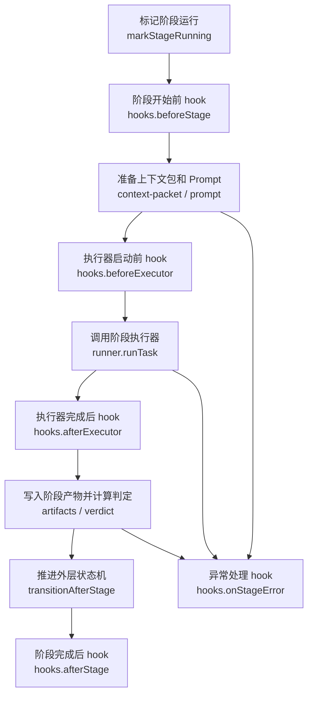

# V2 Runtime Hooks 与 Telemetry 技术方案

Date: 2026-06-23

## 1. 背景

AGT V2 已经把 `Product -> Dev -> QA` workflow 收敛到独立的 `agt2` 入口和 `.agt2` 状态目录。当前 runtime 已经会写入：

- `workflow-run.json`
- `delivery-workflow.json`
- `execution-workflow.json`
- `events.jsonl`
- `tool-calls.jsonl`
- `agents/<agent_run_id>.json`
- `stages/*/attempt-*/prompt.md`
- `artifacts/*`

但 stage 生命周期里的打点逻辑仍然散落在状态机实现里，例如 `product_dev_qa_stage_started` 和 `product_dev_qa_stage_completed` 直接由 `product-dev-qa.ts` 写入。

这个方式能工作，但继续扩展会带来三个问题：

1. 状态机被审计、metrics、token 统计等副作用污染。
2. 以后接 Codex、Claude Code 或其他 executor 时，token usage 和耗时统计没有统一口径。
3. 想分析“哪个阶段慢、哪个阶段 token 高、QA failed 回路消耗多少”时，需要从多个文件临时拼。

因此需要在 V2 runtime 内增加一层 lifecycle hooks。

## 2. 目标

V2 Runtime hooks 的目标是：

- 把 stage 生命周期里的副作用从 workflow 状态机中抽出来。
- 统一记录每个阶段执行前、执行后、executor 前、executor 后的时间点。
- 统一记录 executor 耗时、stage 总耗时、token usage、命令数量、文件变更数量、artifact 数量。
- 让审计事件和 metrics 由内置 hook 负责，而不是写死在状态机里。
- 为未来扩展外部分析、日志上报、通知、失败采样预留入口。

核心约束：

- hooks 第一版只作用于 `packages/runtime/src/V2/`，只服务 `agt2` / `agtv2` 和 `product-dev-qa` workflow。
- hooks 不改 `packages/runtime/src/V1/`，不回填 V1 的 `quick` / `investigate` / `full` profile workflow。
- hooks 和 V2 workflow 状态不再引入 `profile`；执行深度由 stage 级 executor policy 决定。
- hooks 只能做 lifecycle side effects。
- hooks 不能直接决定 workflow 状态流转。
- workflow 状态流转仍然只由 runtime 状态机、stage verdict、human decision 控制。

## 3. 设计原则

| 原则 | 含义 |
| --- | --- |
| 状态机保持纯粹 | `product-dev-qa.ts` 只表达阶段、attempt、verdict、next stage，不直接写审计和 metrics 细节 |
| hooks 可组合 | 一个生命周期点可以触发多个 hook，例如审计事件、metrics、外部上报 |
| hooks 可失败分级 | required hook 失败会阻塞 workflow，optional hook 失败只记录失败事件 |
| usage 标准化 | 不同 executor 的 token usage 映射到同一个 `TokenUsage` 结构 |
| stage 驱动执行 | V2 不再用 `quick` / `investigate` / `full` profile 决定流程；每个 stage 自己声明 executor 策略 |
| 文件可审计 | 所有 hook 输出必须落到 session 目录下，能被 CLI/API/控制台读取 |
| 字段稳定 | metrics 和 events 字段要尽量稳定，避免后续分析脚本反复改 |

## 4. 生命周期模型

P0 定义五个 hook 点：

```text
beforeStage
  stage 已选中，attempt 已确定，workflow 已进入 running

beforeExecutor
  context-packet 和 prompt 已落盘，即将调用 AgentRunner

afterExecutor
  AgentRunner 已返回，已经拿到 agentRun、output、filesChanged、commandsRun、tokenUsage

afterStage
  runtime 已根据 executor 结果生成 verdict、artifact、next state

onStageError
  stage 执行过程中出现 runtime 或 executor 异常
```

对应流程：



## 5. 文件布局

建议新增：

```text
packages/runtime/src/V2/hooks.ts
packages/runtime/src/V2/usage.ts
```

| 文件 | 责任 |
| --- | --- |
| `hooks.ts` | 定义 V2 hook 接口、hook context、V2HookManager、失败策略，并内置 `AuditEventHook` / `StageMetricsHook` |
| `usage.ts` | 定义 `TokenUsage`，提供 OpenAI usage 汇总函数 |

第一版先不拆 `hooks/audit-event.ts` 和 `hooks/stage-metrics.ts`。`AuditEventHook` 与 `StageMetricsHook` 直接内置在 `hooks.ts` 中，等 hook 数量、配置项或测试复杂度上来后再拆文件。

## 6. V2RuntimeHook 接口

```ts
export type V2RuntimeHook = {
  name: string;
  required?: boolean;

  beforeStage?(ctx: V2StageHookContext): Promise<void>;
  beforeExecutor?(ctx: V2ExecutorHookContext): Promise<void>;
  afterExecutor?(ctx: V2ExecutorResultContext): Promise<void>;
  afterStage?(ctx: V2StageResultContext): Promise<void>;
  onStageError?(ctx: V2StageErrorContext): Promise<void>;
};
```

字段说明：

| 字段 | 类型 | 必填 | 含义 |
| --- | --- | --- | --- |
| `name` | `string` | 是 | hook 的稳定名称，用于日志、错误定位和 metrics 标记，例如 `audit_event`、`stage_metrics` |
| `required` | `boolean` | 否 | 是否为强制 hook。`true` 表示失败会阻塞 workflow，默认 `false` |
| `beforeStage` | function | 否 | stage 开始时调用，用于记录 stage start、初始化计时上下文 |
| `beforeExecutor` | function | 否 | prompt 和 context packet 落盘后、runner 调用前调用 |
| `afterExecutor` | function | 否 | runner 返回后调用，用于记录 executor 耗时、token usage、命令和文件变更 |
| `afterStage` | function | 否 | stage verdict 和 next state 已确定后调用，用于记录最终 stage metrics |
| `onStageError` | function | 否 | stage 内发生异常时调用，用于记录错误上下文 |

## 7. V2HookManager

```ts
export class V2HookManager {
  constructor(
    private readonly store: RuntimeStore,
    private readonly hooks: V2RuntimeHook[],
  ) {}

  beforeStage(ctx: V2StageHookContext): Promise<void>;
  beforeExecutor(ctx: V2ExecutorHookContext): Promise<void>;
  afterExecutor(ctx: V2ExecutorResultContext): Promise<void>;
  afterStage(ctx: V2StageResultContext): Promise<void>;
  onStageError(ctx: V2StageErrorContext): Promise<void>;
}
```

字段说明：

| 字段 | 类型 | 含义 |
| --- | --- | --- |
| `store` | `RuntimeStore` | 当前 session 的状态读写入口，`V2HookManager` 用它记录 hook 失败事件 |
| `hooks` | `V2RuntimeHook[]` | 当前 V2 workflow 启用的 hook 列表，按数组顺序执行 |

执行规则：

| 规则 | 含义 |
| --- | --- |
| 顺序执行 | 同一个生命周期点的 hook 按注册顺序执行 |
| required 失败 | 记录 `hook_failed`，然后抛错，让 workflow block |
| optional 失败 | 记录 `hook_failed`，不影响 workflow 继续 |
| hook 不修改 ctx | ctx 视为只读对象，hook 不应该依赖修改 ctx 影响后续流程 |
| hook 不推进状态 | hook 不允许直接修改 `workflow-run.json` 里的 `current_stage`、`status`、`waiting_on` |

## 8. V2StageHookContext

`V2StageHookContext` 是所有 stage lifecycle context 的基础字段。

```ts
export type V2StageHookContext = {
  sessionId: string;
  workflowId: string;
  workflowRunId: string;
  stage: string;
  role: AgentRole;
  attempt: number;
  repoRoot: string;
  projectRoot: string;
  stateRoot: string;
  stageStartedAt: string;
  inputArtifacts: string[];
  requiredOutputs: string[];
  requiredEvidence: string[];
};
```

字段说明：

| 字段 | 类型 | 含义 |
| --- | --- | --- |
| `sessionId` | `string` | 当前 AGT session id，对应 `.agt2/sessions/<session_id>` |
| `workflowId` | `string` | workflow 类型，例如 `product-dev-qa` |
| `workflowRunId` | `string` | workflow run id，来自 `workflow-run.json` |
| `stage` | `string` | 当前 stage key，例如 `product`、`dev.technical_plan`、`dev.implementation`、`qa` |
| `role` | `AgentRole` | 当前执行角色，例如 `product`、`dev`、`qa`。该值来自 stage definition，用于审计和 executor 选择，不作为 workflow 主状态 |
| `attempt` | `number` | 当前 stage 第几次 attempt，从 1 开始 |
| `repoRoot` | `string` | 当前 executor 看到的仓库根目录。task worktree 模式下是 worktree path |
| `projectRoot` | `string` | 原始项目根目录，用于项目级配置和索引 |
| `stateRoot` | `string` | 当前真实状态目录，V2 默认是 `.agt2` |
| `stageStartedAt` | `string` | stage 开始日期，格式为 `YYYY-MM-DD`；耗时计算使用内部 ISO timestamp，不依赖这个展示字段 |
| `inputArtifacts` | `string[]` | 当前 stage 要读取的上游 artifact 名称 |
| `requiredOutputs` | `string[]` | 当前 stage 必须产出的 artifact 名称 |
| `requiredEvidence` | `string[]` | 当前 stage 必须满足的 evidence key |

`V2StageHookContext` 不保留 `current_step`。V2 workflow 的最小控制单元是 stage，`dev.technical_plan` 和 `dev.implementation` 已经是两个不同 stage。hook 如果需要区分技术方案和实现，直接读取 `stage` 即可。

## 9. V2ExecutorHookContext

`V2ExecutorHookContext` 表示 prompt 已准备好，即将调用 runner。

```ts
export type V2ExecutorHookContext = V2StageHookContext & {
  executorStartedAt: string;
  runner: string;
  model?: string;
  maxTurns?: number;
  writeAllowed: boolean;
  promptTraceId: string;
  promptPath: string;
  contextPacketPath: string;
  skillRouting: Record<string, unknown>;
};
```

字段说明：

| 字段 | 类型 | 含义 |
| --- | --- | --- |
| `executorStartedAt` | `string` | executor 即将开始的时间点，ISO 8601 字符串 |
| `runner` | `string` | runner 名称，例如 `openai_sandbox`、`local_fallback` |
| `model` | `string` | 模型名称，例如 `gpt-5.4-mini`；local fallback 可为空 |
| `maxTurns` | `number` | runner 本次允许的最大 turns，由 stage 级 executor policy 或默认 executor 配置决定 |
| `writeAllowed` | `boolean` | 当前 stage 是否允许写代码 |
| `promptTraceId` | `string` | 本阶段实际发送给 runner 的 prompt trace id |
| `promptPath` | `string` | prompt 文件路径，例如 `stages/qa/attempt-001/prompt.md` |
| `contextPacketPath` | `string` | context packet 文件路径 |
| `skillRouting` | `Record<string, unknown>` | 精简后的 skill routing 元数据，只包含匹配状态、注入 skill 名称和缺失 skill；完整审计信息写入 `stages/*/attempt-*/skill-routing.json` |

V2 的 hook context 不使用 `profile` 作为流程字段。`Product -> Dev -> QA` 的阶段顺序由 workflow spec 和状态机决定；`model`、`maxTurns` 这类字段属于 executor 配置，不应该影响 workflow 结构。

### 9.1 V2 profile 去除与 stage executor policy

V1 的 `profile` 表达的是 `quick` / `investigate` / `full` 这类执行深度。V2 的产品语义已经固定为一个可审计 workflow：

```text
intake_summary -> product -> product_check -> dev.technical_plan -> dev_plan_check -> dev.implementation -> qa
```

因此 V2 不再需要把 `profile` 写进 session、workflow、execution workflow 或 hook context。执行深度改由 stage 级 executor policy 控制。

建议的 stage 定义：

```ts
const STAGES = {
  "dev.technical_plan": {
    role: "dev",
    canWriteCode: false,
    executor: {
      maxTurns: 4,
    },
  },
  "dev.implementation": {
    role: "dev",
    canWriteCode: true,
    executor: {
      maxTurns: 8,
    },
  },
  qa: {
    role: "qa",
    canWriteCode: false,
    executor: {
      maxTurns: 6,
    },
  },
};
```

runner 接口也应从接收 `profile` 改为接收已解析好的 executor 参数：

```ts
runner.runTask({
  sessionId,
  role: stage.role,
  repoRoot,
  prompt,
  writeAllowed: stage.canWriteCode,
  maxTurns: stage.executor.maxTurns,
});
```

字段归属：

| 字段 | V2 归属 |
| --- | --- |
| `profile` | 移除，不进入 V2 session、workflow、execution workflow、hook context |
| `default_profile` | 移除，不作为 V2 config 字段 |
| `max_turns[profile]` | 替换为 executor 默认值或 `stages.<stage>.executor.maxTurns` |
| `model` | executor 配置字段，可进入 executor hook context 和 agent metadata |
| `maxTurns` | executor 配置字段，可进入 executor hook context 和 agent metadata |
| `writeAllowed` | stage policy 字段，可进入 executor hook context 和 agent metadata |

这样 hooks 看到的是“这个 stage 用什么 executor 参数跑了”，而不是“这个 workflow 用哪个 profile 跑”。这能避免 V1 的 profile 概念继续污染 V2 的产品交付流程。

## 10. AgentTaskResult 扩展

当前 `AgentTaskResult` 需要增加 `tokenUsage`。

```ts
export type AgentTaskResult = {
  agentRun: AgentRunRecord;
  output: string;
  filesChanged: string[];
  commandsRun: string[];
  tokenUsage?: TokenUsage;
};
```

字段说明：

| 字段 | 类型 | 含义 |
| --- | --- | --- |
| `agentRun` | `AgentRunRecord` | 本次 runner 执行记录，对应 `agents/<agent_run_id>.json` |
| `output` | `string` | runner 最终输出文本 |
| `filesChanged` | `string[]` | runtime 观察到的变更文件列表 |
| `commandsRun` | `string[]` | runtime 从 SDK run items 或 fallback 里观察到的命令 |
| `tokenUsage` | `TokenUsage` | 标准化 token 消耗；没有可用数据时为空 |

## 11. TokenUsage

```ts
export type TokenUsage = {
  inputTokens?: number;
  outputTokens?: number;
  totalTokens?: number;
  cachedInputTokens?: number;
  reasoningTokens?: number;
  raw?: unknown;
};
```

字段说明：

| 字段 | 类型 | 含义 |
| --- | --- | --- |
| `inputTokens` | `number` | 输入 token 数，OpenAI usage 中通常对应 `input_tokens` 或 `prompt_tokens` |
| `outputTokens` | `number` | 输出 token 数，OpenAI usage 中通常对应 `output_tokens` 或 `completion_tokens` |
| `totalTokens` | `number` | 总 token 数。若 provider 未直接返回，则用 input + output 汇总 |
| `cachedInputTokens` | `number` | 命中缓存的输入 token 数，用于分析缓存节省 |
| `reasoningTokens` | `number` | 推理 token 数，如果 provider 返回该字段则记录 |
| `raw` | `unknown` | provider 原始 usage 摘要，用于兼容未知字段和后续排查 |

OpenAI 汇总规则：

| 输入来源 | 处理方式 |
| --- | --- |
| `rawResponses[].usage.input_tokens` | 汇总到 `inputTokens` |
| `rawResponses[].usage.output_tokens` | 汇总到 `outputTokens` |
| `rawResponses[].usage.total_tokens` | 汇总到 `totalTokens` |
| `rawResponses[].usage.input_token_details.cached_tokens` | 汇总到 `cachedInputTokens` |
| `rawResponses[].usage.output_token_details.reasoning_tokens` | 汇总到 `reasoningTokens` |
| 未识别 usage 字段 | 保留在 `raw` |

## 12. V2ExecutorResultContext

`V2ExecutorResultContext` 表示 runner 已完成。

```ts
export type V2ExecutorResultContext = V2ExecutorHookContext & {
  executorCompletedAt: string;
  executorDurationMs: number;
  agentRunId: string;
  executorStatus: "completed" | "blocked" | "failed";
  outputBytes: number;
  filesChanged: string[];
  commandsRun: string[];
  tokenUsage?: TokenUsage;
};
```

字段说明：

| 字段 | 类型 | 含义 |
| --- | --- | --- |
| `executorCompletedAt` | `string` | executor 结束时间，ISO 8601 字符串 |
| `executorDurationMs` | `number` | executor 耗时，单位毫秒 |
| `agentRunId` | `string` | 本次 executor run id |
| `executorStatus` | enum | runner 结果状态，来自 `AgentRunRecord.status` |
| `outputBytes` | `number` | runner 输出文本字节数，用于分析输出膨胀 |
| `filesChanged` | `string[]` | 本次 executor 造成或观察到的变更文件 |
| `commandsRun` | `string[]` | 本次 executor 运行过的命令 |
| `tokenUsage` | `TokenUsage` | 本次 executor 标准化 token 消耗 |

## 13. V2StageResultContext

`V2StageResultContext` 表示 stage 已经完成 verdict 和状态迁移计算。

```ts
export type V2StageResultContext = V2ExecutorResultContext & {
  stageCompletedAt: string;
  stageDurationMs: number;
  verdict: "passed" | "failed" | "blocked";
  artifactNames: string[];
  artifactPaths: string[];
  nextStage?: string;
  blockedReason?: string;
};
```

字段说明：

| 字段 | 类型 | 含义 |
| --- | --- | --- |
| `stageCompletedAt` | `string` | stage 完成时间，ISO 8601 字符串 |
| `stageDurationMs` | `number` | stage 总耗时，从 `beforeStage` 到 `afterStage` |
| `verdict` | enum | runtime 对本 stage 的判定结果 |
| `artifactNames` | `string[]` | 本 stage 产出的 artifact 名称 |
| `artifactPaths` | `string[]` | 本 stage 产出的 artifact 文件路径 |
| `nextStage` | `string` | 下一阶段 key；done、waiting human 或 blocked 时可为空 |
| `blockedReason` | `string` | 阻塞原因，只在 verdict 为 `blocked` 或 workflow block 时填写 |

## 14. V2StageErrorContext

```ts
export type V2StageErrorContext = V2StageHookContext & {
  failedAt: string;
  phase:
    | "before_stage"
    | "prepare_context"
    | "before_executor"
    | "executor"
    | "after_executor"
    | "write_artifacts"
    | "after_stage";
  errorName: string;
  errorMessage: string;
  stack?: string;
  promptTraceId?: string;
  agentRunId?: string;
};
```

字段说明：

| 字段 | 类型 | 含义 |
| --- | --- | --- |
| `failedAt` | `string` | 失败发生时间，ISO 8601 字符串 |
| `phase` | enum | 失败发生在哪个 lifecycle phase |
| `errorName` | `string` | Error name，例如 `Error`、`ZodError` |
| `errorMessage` | `string` | 错误消息 |
| `stack` | `string` | stack trace。写入前要避免包含敏感信息 |
| `promptTraceId` | `string` | 如果 prompt 已生成，则记录 prompt trace id |
| `agentRunId` | `string` | 如果 agent run 已创建，则记录 agent run id |

## 15. 内置 AuditEventHook

`AuditEventHook` 负责把 lifecycle 事件写入 `events.jsonl`。

建议事件 kind：

| kind | 触发点 | 含义 |
| --- | --- | --- |
| `stage_started` | `beforeStage` | stage attempt 开始 |
| `executor_started` | `beforeExecutor` | runner 即将开始 |
| `executor_completed` | `afterExecutor` | runner 已返回 |
| `stage_completed` | `afterStage` | stage verdict 和 next state 已确定 |
| `stage_failed` | `onStageError` | stage 发生异常 |
| `hook_failed` | V2HookManager | 某个 hook 执行失败 |

`events.jsonl` 字段：

| 字段 | 类型 | 含义 |
| --- | --- | --- |
| `at` | `string` | 事件发生时间 |
| `session_id` | `string` | 当前 session id |
| `kind` | `string` | 事件类型 |
| `role` | `AgentRole` | 当前角色 |
| `status` | `string` | 事件状态，例如 `running`、`completed`、`failed`、`blocked` |
| `message` | `string` | 面向人类的短摘要 |
| `details` | object | 机器可读详情 |

`details` 建议字段：

| 字段 | 类型 | 含义 |
| --- | --- | --- |
| `workflow_id` | `string` | workflow 类型 |
| `workflow_run_id` | `string` | workflow run id |
| `stage` | `string` | stage key |
| `attempt` | `number` | stage attempt number |
| `step` | `string` | stage 内部 step |
| `runner` | `string` | runner 名称 |
| `model` | `string` | 模型名称 |
| `prompt_trace_id` | `string` | prompt trace id |
| `agent_run_id` | `string` | agent run id |
| `verdict` | `string` | stage verdict |
| `next_stage` | `string` | 下一 stage |
| `duration_ms` | `number` | 当前事件对应耗时 |
| `token_usage` | `TokenUsage` | 标准化 token 消耗 |
| `artifacts` | `string[]` | 本 stage 产物名称 |
| `error` | `string` | 错误消息 |

## 16. 内置 StageMetricsHook

`StageMetricsHook` 负责写入 `metrics.jsonl`。

建议路径：

```text
.agt2/sessions/<session_id>/metrics.jsonl
```

`metrics.jsonl` 每行代表一个 metric event。P0 只写 `stage.completed`，后续可增加 `executor.completed`。

```json
{
  "schema_version": 1,
  "at": "2026-06-23T10:00:00.000Z",
  "kind": "stage.completed",
  "session_id": "20260623T100000000-abc",
  "workflow_id": "product-dev-qa",
  "workflow_run_id": "wr_20260623_001",
  "stage": "qa",
  "role": "qa",
  "attempt": 1,
  "runner": "openai_sandbox",
  "model": "gpt-5.4-mini",
  "verdict": "passed",
  "stage_duration_ms": 130000,
  "executor_duration_ms": 120000,
  "token_usage": {
    "inputTokens": 10000,
    "outputTokens": 2000,
    "totalTokens": 12000
  },
  "files_changed_count": 0,
  "commands_run_count": 3,
  "artifact_count": 2
}
```

字段说明：

| 字段 | 类型 | 含义 |
| --- | --- | --- |
| `schema_version` | `number` | metrics schema 版本，P0 固定为 `1` |
| `at` | `string` | metric 写入时间 |
| `kind` | `string` | metric 类型，P0 使用 `stage.completed` |
| `session_id` | `string` | 当前 session id |
| `workflow_id` | `string` | workflow 类型 |
| `workflow_run_id` | `string` | workflow run id |
| `stage` | `string` | stage key |
| `role` | `AgentRole` | 当前角色 |
| `attempt` | `number` | stage attempt number |
| `runner` | `string` | runner 名称 |
| `model` | `string` | 模型名称。local fallback 可为空 |
| `verdict` | enum | stage 判定结果 |
| `stage_duration_ms` | `number` | stage 总耗时 |
| `executor_duration_ms` | `number` | executor 耗时 |
| `token_usage` | `TokenUsage` | 标准化 token 消耗 |
| `files_changed_count` | `number` | 变更文件数量 |
| `commands_run_count` | `number` | 命令数量 |
| `artifact_count` | `number` | 本 stage 产物数量 |

## 17. hook_failed 事件

hook 执行失败时，`V2HookManager` 写入 `hook_failed` event。

```json
{
  "at": "2026-06-23T10:00:00.000Z",
  "session_id": "...",
  "kind": "hook_failed",
  "role": "qa",
  "status": "failed",
  "message": "optional hook stage_metrics failed.",
  "details": {
    "hook": "stage_metrics",
    "required": false,
    "lifecycle": "afterStage",
    "stage": "qa",
    "attempt": 1,
    "error": "EACCES: permission denied"
  }
}
```

字段说明：

| 字段 | 类型 | 含义 |
| --- | --- | --- |
| `hook` | `string` | 失败 hook 名称 |
| `required` | `boolean` | hook 是否 required |
| `lifecycle` | `string` | 失败发生在哪个 lifecycle method |
| `stage` | `string` | 当前 stage |
| `attempt` | `number` | 当前 attempt |
| `error` | `string` | 错误消息 |

失败策略：

| hook 类型 | 处理方式 |
| --- | --- |
| required | 写 `hook_failed`，然后抛错，stage 进入 blocked |
| optional | 写 `hook_failed`，workflow 继续执行 |

stage runtime 错误策略：

| 错误来源 | 处理方式 |
| --- | --- |
| executor 抛错 | 写 `stage_error phase=executor`，创建 blocked agent run，stage verdict 为 `blocked`，workflow 进入 `blocked` |
| context / prompt / artifact 落盘失败 | 写 `stage_error`，外层 catch 创建 runtime-error agent run，写 `runtime-error.json` 和 `stage_blocked_by_error`，workflow 进入 `blocked` |
| transition / post-state 落盘失败 | 外层 catch 创建 runtime-error agent run；若状态文件本身无法写入，命令会失败并保留前序 `stage_error` / `hook_failed` 证据 |

P0 默认：

| hook | required | 原因 |
| --- | --- | --- |
| `AuditEventHook` | 是 | 可审计是 AGT 的核心承诺 |
| `StageMetricsHook` | 否 | metrics 缺失不应该阻塞本地交付 |

## 18. 与现有文件的关系

| 现有文件 | 变化 |
| --- | --- |
| `events.jsonl` | 继续保留，但由 `AuditEventHook` 写 stage lifecycle 事件 |
| `tool-calls.jsonl` | 不变，仍记录 runner/tool 级观察数据 |
| `agents/<agent_run_id>.json` | metadata 增加 `token_usage`、`executor_duration_ms`、`model`、`max_turns`；不再记录 V2 `profile` |
| `<agent_run_id>-sdk-trace.json` | 继续保留 raw SDK 摘要，作为 usage 汇总的原始证据 |
| `workflow-run.json` | 不放 metrics，不放 `profile`；`current_step` 暂保留在 workflow state 里，hook context 不依赖它 |
| `execution-workflow.json` | 不放 `profile`，只记录 stage 执行索引、prompt trace、agent run、artifact、commands、files |
| `config.json` | V2 移除 `default_profile` / `max_turns[profile]`，改为 executor 默认值和 stage executor policy |
| `metrics.jsonl` | 新增，专门用于耗时和 token 分析 |

## 19. 代码改造点

| 文件 | 改造 |
| --- | --- |
| `product-dev-qa.ts` | 创建 `V2HookManager`，在生命周期点调用 hooks；从 stage definition 读取 executor policy，不再向 runner 传 `profile` |
| `runner.ts` | `AgentTask` 移除 `profile`，改为接收 `maxTurns`；`AgentTaskResult` 增加 `tokenUsage`，OpenAI runner 汇总 usage |
| `store.ts` | 增加 `appendMetric` / `readMetrics`，或先提供 `appendJsonl` 封装 |
| `schema.ts` | 增加 `MetricRecordSchema`、`TokenUsageSchema`；V2 session / execution schema 移除 `profile`，workflow state 暂保留 `current_step` |
| `hooks.ts` | 定义 `V2RuntimeHook` 抽象，并内置 audit event 和 stage metrics 两个 hook |
| `skill-routing.ts` | skill 选择从 `profile` 维度改为 `workflow_id`、`stage`、`role` 维度 |
| `cli/src/V2/index.ts` | 移除 V2 `--profile` / `--default-profile` 表面，避免与 V1 profile workflow 混淆 |
| `status.ts` | P0 可暂不展示 metrics，后续再加 latest metrics summary |
| `server/src/index.ts` | P0 可暂不加 API，后续增加 `/api/sessions/:sessionId/metrics` |

## 20. 测试方案

| 测试 | 目的 |
| --- | --- |
| V2HookManager required 失败测试 | required hook 失败会让 stage blocked |
| V2HookManager optional 失败测试 | optional hook 失败只写 `hook_failed` |
| product-dev-qa smoke 测试 | 每个 stage 都触发 before/after hooks |
| metrics 写入测试 | `metrics.jsonl` 包含 stage duration、executor duration、attempt、verdict |
| OpenAI usage 汇总单测 | 多个 raw response usage 能正确累加 |
| local fallback 测试 | 没有 token usage 也能正常完成 workflow |

## 21. 验收标准

- `npm run typecheck` 通过。
- `npm test` 通过。
- `npm run build` 通过。
- `agt2 deliver -> approve -> approve` 能完成。
- `events.jsonl` 中能看到标准化的 `stage_started`、`executor_started`、`executor_completed`、`stage_completed`。
- `metrics.jsonl` 中能看到每个 stage 的耗时、attempt、runner、verdict 和 token usage。
- OpenAI runner 有 usage 时能写入 `token_usage`。
- local fallback 没有 usage 时不报错。
- 状态机代码里不再直接写 stage lifecycle event 细节。
