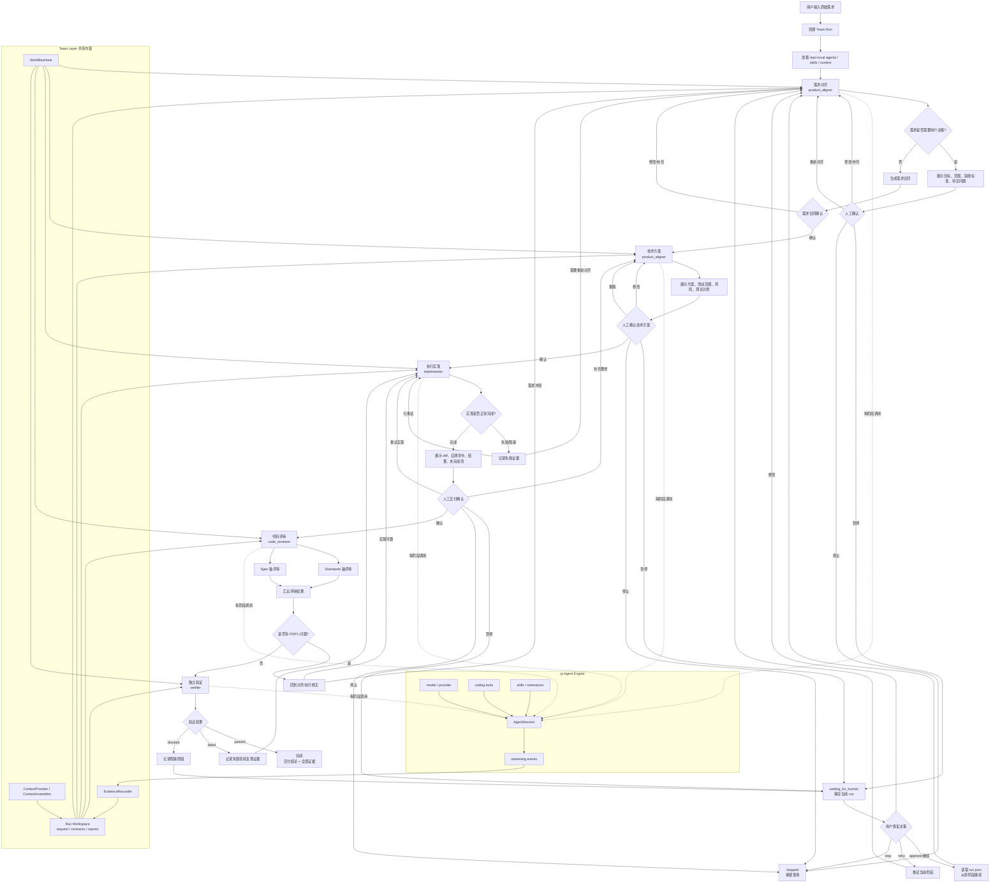
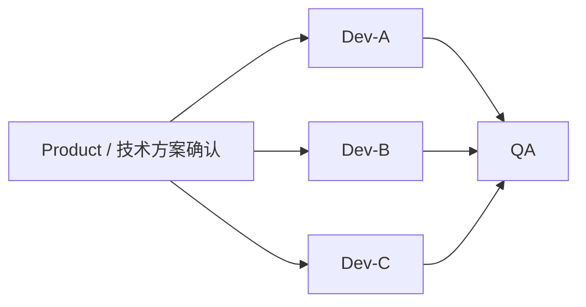

# 基于 pi Engine 的 Agent Team Workflow 技术方案（讨论稿）

- 日期：2026-08-08
- 状态：Draft，待产品与技术方案对齐
- 关联仓库：`agent-team-runtime`
- 关联现有方案：`docs/workflow-specs/2026-06-21-product-dev-qa-workflow-runtime.md`

## 1. 背景

`agent-team-runtime` 当前定位是一个 AI 研发交付 workflow runtime，负责将需求推进经过 Product、Dev、QA 等阶段，并保存状态、产物和验证证据。

在实际使用过程中，我们发现直接通过现有 runtime 调度 `codex-exec` 的体验不理想：

- 小需求也要经过较重的 runtime 流程，固定开销明显，整体执行时间偏长；
- 大需求执行期间不透明，通常要等 executor 结束后才能看到完整结果；
- 阶段之间缺少稳定、及时的人工 check，用户无法在需求对齐或实现完成后及时确认、修改或停止；
- runtime 自己维护 executor、skill routing、context packet、状态和事件处理，和底层 coding agent 的能力存在重复建设；
- 当前多 agent 的实际使用体验中，pi 的 agent 配置、prompt 和 subagent 调度已经验证出较好的效果。

因此需要重新审视当前架构：不再把 pi 与 Codex、OpenAI Agents SDK 等作为长期平级的执行器能力，而是考虑将 pi 作为底层 Agent Engine，在其上实现团队级的 workflow 协调能力。

## 2. 当前问题

### 2.1 执行链路固定开销过高

当前每个阶段除了模型执行外，还可能包含 worktree 创建、上下文包构建、skill 路由、executor 启动、输出解析、运行记录和产物投影等步骤。

这些步骤对大需求有价值，但对小需求同样存在，导致：

```text
小需求
  -> 固定初始化成本
  -> 多阶段执行成本
  -> executor 冷启动成本
  -> 最终才能得到结果
```

问题不一定完全来自模型速度，也来自 workflow 没有区分任务规模和交付路径。

### 2.2 执行过程缺少实时可见性

当前用户更容易看到最终报告，而不是看到每个角色的实时执行过程，例如：

- 当前处于 Product、Dev 还是 QA；
- 当前角色正在读取什么或执行什么命令；
- 是否已经修改文件；
- 测试是否正在运行或已经失败；
- executor 是正常执行、超时还是异常退出。

当大需求运行时间较长时，用户无法判断它是在正常推进，还是已经卡住。

### 2.3 阶段交接、人工检查和会话连续性不稳定

阶段之间如果主要依赖 prompt 或完整聊天历史，会出现：

- Product 的结论没有形成稳定的下游输入；
- Dev 不一定能看到经过确认的需求边界；
- QA 不一定能看到实现报告和自测证据；
- 用户无法在关键阶段进行确认、补充或阻止继续；
- workflow 可能在没有明确检查的情况下直接推进；
- 用户明确要求 `grill-me` 或要求先卡住确认时，旧 runtime 可能继续执行，不会真正暂停等待用户决定；
- 即使用户想确认，往往还要结束当前会话、重新启动会话，导致上下文、现场和交互连续性被破坏。

因此，人工 check 不能只是 prompt 中的一句话，也不能依赖 agent 自觉询问。它必须由 workflow/orchestrator 作为机器可控的暂停状态管理，并且支持在**同一次 workflow run、同一个交互会话**中恢复。

### 2.4 runtime 与底层 Agent Engine 边界不清

当前 AGT 自己维护多套执行器和部分 agent 能力，而 pi 已经提供了：

- agent session 和 agent loop；
- 模型与 provider 管理；
- coding tools；
- skills、extensions、prompt 和 context files 加载；
- session event stream；
- 工具调用和使用量信息。

如果上层继续复制这些能力，后续会同时维护两套 agent runtime，增加复杂度和行为差异。

## 3. 要解决的问题

本方案要解决的是**团队级 AI 研发交付协调问题**，而不是重新实现一个 coding agent。

具体目标：

1. 使用 pi 作为底层 Agent Engine，复用其 agent、model、tools、skills、session 和事件能力；
2. 让多个角色按照明确 workflow 协作，而不是依赖主会话临时组织 prompt；
3. 让阶段之间通过仓库内可追踪的结构化内容交接；
4. 在 Product、Dev 等关键节点提供明确的人工 check；
5. 将执行过程实时展示给用户，并保留可审计证据；
6. 对小需求提供更轻的执行路径，减少不必要的固定流程；
7. 将 agent、skill、workflow 和契约沉淀为 repo-local 资源，支持团队通过 Git 共享；
8. 为后续接入需求资料、仓库知识、历史决策和记忆系统保留扩展点。

## 4. 产品定位和边界

### 4.1 定位

目标系统是一个 **Agent Team Layer**：

> pi 负责单个 agent 如何执行；Agent Team Layer 负责多个 agent 为什么协作、按什么顺序协作、交接什么内容，以及何时需要人确认。

```text
Agent Team Layer
  - workflow 顺序
  - 阶段交接
  - 共享上下文
  - 人工 gate
  - 运行状态
  - 证据和审计
  - 团队分发
          |
          v
pi Agent Engine
  - agent session
  - model/provider
  - coding tools
  - skills/extensions
  - prompt/context loading
  - streaming events
```

### 4.2 明确不重复实现的能力

团队层不重新实现：

- agent loop；
- 模型请求和 provider 适配；
- read、bash、edit、write 等 coding tools；
- pi 的 skills、extensions 和 context discovery；
- session 内的消息流、tool call 和 usage 机制；
- pi 已经提供的 subagent 基础执行能力。

团队层只在这些能力之上做二次封装和约束。

## 5. 总体技术方案

### 5.1 核心对象

| 对象 | 责任 |
| --- | --- |
| `PiAgentTeam` | 面向用户的薄封装，负责按 workflow 调度 pi agent，并处理人工确认 |
| `TeamWorkflow` | 定义阶段顺序、阶段输入输出、人工 gate 和停止条件 |
| `RoleBinding` | 将 workflow 阶段绑定到 pi agent，例如 `product -> product_aligner` |
| `StageContract` | 定义阶段必须读取、产出和验证的结构化内容 |
| `RunWorkspace` | 保存本次需求的共享上下文、阶段产物和人类可读报告 |
| `ContextAssembler` | 在调用 pi 前汇总需求、仓库资料、阶段产物和可选扩展上下文 |
| `ContextProvider` | 从仓库、当前 run、需求系统或记忆系统提供上下文 |
| `MemoryProvider` | 查询或建议长期记忆，不能默认将未经确认的推断写成事实 |
| `WorkflowHook` | 为阶段前后、人工确认和失败处理预留扩展点 |
| `Gate` | 在阶段交接处暂停并等待人工确认、编辑、重试或停止 |
| `RoleExecutor` | 对 pi 的底层执行能力进行统一封装 |
| `EvidenceRecorder` | 记录输入、事件、tool calls、退出原因、产物和 verdict |

第一版实际只需要实现 `PiAgentTeam`、`TeamWorkflow`、`RoleBinding`、`RunWorkspace`、`Gate` 和 `RoleExecutor` 的最小能力；`ContextProvider`、`MemoryProvider`、`WorkflowHook` 先保留接口和调用位置，不接入具体外部系统。

### 5.2 角色绑定

角色定义优先复用 pi 的 agent markdown 配置，例如：

```text
.pi/agents/
  product_aligner.md
  implementer.md
  verifier.md
  code_reviewer.md
  evidence_investigator.md
```

workflow 只声明阶段使用哪个角色，不重新声明完整的 system prompt、model 和 tools：

```json
{
  "workflow": "product-dev-qa",
  "stages": [
    { "key": "product", "agent": "product_aligner" },
    { "key": "dev", "agent": "implementer" },
    { "key": "qa", "agent": "verifier" }
  ]
}
```

repo-local agent 定义是团队可共享的事实来源；个人全局 agent 可以作为本地覆盖或开发实验，但不能成为团队 workflow 的唯一依赖。

### 5.3 workflow 流程

标准流程不是一次性直通，而是包含需求对齐、技术方案确认、执行、评审和验证的受控流程：



其中：

- **Team Layer** 负责阶段顺序、人工确认、暂停恢复、内容交接和状态判断；
- **pi Agent Engine** 负责 agent session、模型、工具、skills 和实时事件；
- **Run Workspace** 是阶段之间共享的内容介质；
- **EvidenceRecorder** 保存 prompt、事件、tool call、命令、diff、状态和人工决策；
- Product 和技术方案未确认时，Implementer 不允许启动；
- Review 的 Standards / Spec 任一轴发现 P0/P1，都不能直接进入验证；
- QA failed 回到实现，QA blocked 回到人工等待；
- 用户暂停后从同一个 `runId` 恢复，不销毁并重开整个会话。

第一阶段只验证单线流程，不先做并行 Dev。后续可以扩展为：



阶段推进由代码和结构化状态控制，不能只依赖模型在 prompt 中自行决定是否跳过阶段。

### 5.4 小需求快路径

不能假设换成 pi 后所有小需求都会自动变快。小需求慢的根因之一是所有需求都走同一条重流程。

建议支持 workflow profile，而不是第一版就实现复杂的自动分类：

```text
quick：Dev -> 轻量 QA / 检查
standard：Product -> Dev -> QA
full：Product -> Plan Check -> Dev -> QA -> Review
```

后续可以增加 intake agent 自动建议 profile，但用户应能覆盖分类结果。

## 6. pi 底层封装方案

### 6.1 稳定抽象

团队层不直接依赖某一种 pi 调用方式，先定义统一的角色执行接口：

```ts
interface RoleExecutor {
  run(input: {
    role: string;
    prompt: string;
    repoRoot: string;
    workspaceRoot: string;
    runId: string;
  }): Promise<RoleExecutionResult>;

  cancel(): Promise<void>;
}
```

```ts
type RoleExecutionResult = {
  status: "completed" | "failed" | "timed_out" | "cancelled";
  output: string;
  exitCode?: number;
  events?: unknown[];
  commandsRun?: string[];
  filesChanged?: string[];
  usage?: Record<string, unknown>;
};
```

### 6.2 两种底层实现

#### `PiSdkExecutor`

直接调用 pi SDK：

```ts
createAgentSession({
  cwd: repoRoot,
  model,
  tools,
  resourceLoader,
  sessionManager,
});
```

适合：

- prompt 和 role 调试；
- 编排单元测试；
- 不涉及真实仓库修改的契约测试；
- 后续对 pi SDK 做更深的进程内集成。

#### `PiProcessExecutor`

由团队层启动独立 pi 进程，使用 pi 提供的稳定 headless/RPC 能力承载角色执行。

适合：

- 正式 workflow；
- 需要 timeout、cancel、retry 的场景；
- implementer、verifier 等会执行真实命令的阶段；
- 团队共享和持续运行。

当前讨论倾向于：**正式运行默认使用 `PiProcessExecutor`，但不复制 pi 的 agent loop 和 subagent 实现；`PiSdkExecutor` 作为兼容后端保留。** 这一点仍需最终确认。

### 6.3 实时可见性

执行器必须边执行边产生事件，团队层不能只等待最终结果：

```text
role_started
assistant_text_delta
thinking_delta（按配置决定是否展示）
tool_started
command_started / command_output
file_changed
tool_finished
role_completed / role_failed / role_timed_out
```

终端、pi extension 或未来 Web UI 都消费同一套团队层事件，而不是各自重新解析 agent 输出。

## 7. 共享内容、需求对齐和记忆扩展

### 7.1 三类内容分层

```text
代码仓库 / worktree
  代码、测试、项目文档

本次 Run Workspace
  当前需求、阶段交接、实现报告、QA 报告、临时上下文

团队长期知识
  领域规则、架构决策、编码规范、已确认经验
```

三者不能混为一个目录，也不能把一次 run 的临时推断自动写入长期记忆。

### 7.2 Context Provider

通过 Provider 扩展上下文来源：

```ts
interface ContextProvider {
  name: string;
  provide(request: ContextRequest): Promise<ContextItem[]>;
}
```

初期可以支持：

- `RepoContextProvider`：读取 repo-local 的 `AGENTS.md`、项目文档、规范和相关文件；
- `RunContextProvider`：读取当前 run 已确认的阶段产物；
- `GitContextProvider`：提供历史提交、相关 diff 或决策线索。

后续可接入：

- Feishu / Lark 文档；
- Issue、Bug、PR 系统；
- 代码图谱；
- MySQL、Redis、日志等只读调查数据；
- 独立记忆服务。

Provider 只负责提供候选内容，团队层负责按阶段、角色、优先级、大小限制进行筛选并生成 context packet。

### 7.3 记忆可信度

长期记忆必须有来源和可信度，至少区分：

```text
confirmed   已人工确认，可作为规则
observed    从代码或证据观察到，尚未确认
inferred    agent 推断，仅作参考
deprecated  已废弃
```

只有通过人工 gate 或明确的记忆晋升动作，内容才可以从当前 run 进入团队长期知识。

记忆不是第一版的硬依赖。第一版只要求当前 run 的内容可以作为上下文被后续阶段读取，并为未来的长期记忆查询和晋升保留 Provider、Assembler 和 Hook 接口。

### 7.4 上下文工程扩展点

除了接入外部记忆，团队层还需要允许对上下文进行工程化处理，例如：

- 按角色和阶段选择不同资料；
- 控制上下文优先级、大小和 token 预算；
- 对需求、仓库规则、历史决策进行去重和冲突提示；
- 把长文档转换成阶段可消费的摘要或索引；
- 在 prompt 中声明每条内容的来源、可信度和版本；
- 对不同 workflow 使用不同的上下文组装策略。

因此不直接把所有内容拼成一个长 prompt，而是预留 `ContextAssembler`：

```ts
interface ContextAssembler {
  assemble(input: {
    task: string;
    stage: string;
    role: string;
    repoRoot: string;
    runId: string;
    providers: ContextProvider[];
  }): Promise<AssembledContext>;
}
```

其中 `AssembledContext` 至少包含：

```ts
interface AssembledContext {
  items: ContextItem[];
  files: string[];
  promptSections: string[];
  sources: Array<{ id: string; source: string; contentHash?: string }>;
}
```

第一版可以只有 `RepoContextProvider` 和 `RunContextProvider`，以后可以增加 `MemoryProvider`、Feishu、Issue、代码图谱等来源，而不需要修改 `PiAgentTeam` 的角色执行接口。

### 7.5 Workflow Hook 扩展点

为需求对齐和记忆沉淀预留阶段钩子：

```ts
interface WorkflowHook {
  beforeStage?(context: StageHookContext): Promise<void>;
  afterStage?(context: StageHookContext): Promise<void>;
  beforeGate?(context: GateHookContext): Promise<void>;
  afterGate?(context: GateHookContext): Promise<void>;
}
```

可支持的后续能力包括：

```text
before product：查询历史需求和领域规则
before dev：查询架构决策和相关实现经验
after dev：收集实现报告和可沉淀经验
after qa：建议哪些已确认内容晋升为团队记忆
```

Hook 不改变 pi 的 agent loop，只负责在 workflow 边界处理上下文和产物。

## 8. Check / Gate 设计

Check 是 workflow 的正式能力，不是要求 agent 自己“记得问用户”。

### 8.1 Check 必须是真正的暂停状态

已确认：第一版必须支持 `waiting_for_human` 和同一 run 恢复；如果还需要杀会话、重开会话才能确认，就不算解决旧 AGT 的核心体验问题。

Check 是 workflow 的正式能力，不是要求 agent 自己“记得问用户”，也不是在输出末尾打印一句“请确认”。

当用户说 `grill-me`、要求先对齐、要求卡住，或者 workflow 到达配置好的 gate 时，编排层必须：

1. 停止启动下一个阶段；
2. 将当前 run 持久化为 `waiting_for_human`；
3. 保留当前阶段的输入、输出、事件、文件变更和证据；
4. 在当前交互入口展示待确认内容和可选动作；
5. 用户确认后，从原 run 继续，而不是销毁会话再重新开始。

已确认的暂停语义：

- Product / Dev 等配置好的阶段 gate 是**硬 Gate**，无论 agent 是否主动提问，到达节点都必须暂停；
- 用户在运行中输入 `grill-me`、“先卡住”或等价指令时，当前 agent 允许完成正在执行的 tool call；
- 当前 tool call 完成后，不再开始新的 tool call，也不进入下一个阶段；
- 编排层保存现场并进入 `waiting_for_human`，等待用户决定。

建议状态：

```text
running
waiting_for_human
approved
rejected
retry_requested
stopped
```

“确认”必须是编排器消费的结构化事件，例如：

```json
{
  "type": "human_gate_decision",
  "run_id": "...",
  "stage": "product",
  "decision": "approve",
  "comment": "范围和验收标准确认",
  "at": "..."
}
```

这样可以保证 `grill-me` 的效果是：当前会话真正停下来等待决策；用户回复后继续同一次 run，不需要手动杀掉会话、重新开一个会话、重新解释背景。

### 8.2 Product Check

Product 阶段结束后展示：

- 目标和范围；
- 不做什么；
- 验收标准；
- 关键规则和约束；
- 待确认问题；
- 相关上下文来源。

用户可选择：

```text
approve   进入 Dev
edit      修改需求合同后重新确认
retry     重跑 Product
stop      停止并保留本次 run
```

### 8.3 Dev Check

Dev 阶段结束后展示：

- 改动文件；
- 执行过的命令和结果；
- 未完成项；
- 实现歧义；
- 当前 diff 摘要。

用户可选择：

```text
approve   进入 QA
edit      补充约束或要求调整
retry     重跑 Dev
stop      停止并保留现场
```

QA 只能基于确认后的需求合同和实现产物独立验证，不能因为 Dev 返回“完成”就自动通过。

## 9. 运行状态和证据

运行状态与 workspace 分开：

```text
repository/worktree/
  agent 修改的代码

team-workspace/runs/<run-id>/
  需求和阶段交接内容

runtime-state/runs/<run-id>/
  状态、事件、退出原因、审计信息
```

每个角色 attempt 至少记录：

- run ID、stage、role；
- pi 版本、Node 版本、model/provider；
- agent 定义和 skills 的 hash；
- 输入文件和输出文件 hash；
- 实际 prompt 或执行请求的引用；
- tool calls、命令、退出码；
- 开始时间、结束时间、耗时；
- timeout、cancel、crash 信息；
- 最终结构化状态和 verdict；
- 人工 check 的决定、时间和修改内容。

机器判定使用 JSON，报告和人工阅读使用 Markdown。文件写入使用临时文件加 rename，避免阶段交接读到半写内容。

## 10. 团队推广方式

团队共享的事实来源应位于目标仓库：

```text
.pi/agents/       角色 agent 定义
.pi/skills/       项目级 skills
.pi/prompts/      prompt templates（如需要）
workflows/        workflow 配置和阶段契约
team-workspace/   模板或运行产物入口
```

同时锁定：

- Node.js 版本；
- pi SDK / CLI 版本；
- package lock；
- workflow 和契约版本。

不能要求团队成员依赖某个人的 `~/.pi/agent/agents/` 或 `~/.agents/skills/` 才能运行同一套 workflow。

## 11. 分阶段实施建议

### 阶段 0：方案和协议对齐

只确认：

- pi 与团队层的边界；
- `PiAgentTeam` 的薄封装边界；
- workflow 阶段；
- role binding；
- stage contract；
- `ContextProvider`、`ContextAssembler`、`MemoryProvider` 和 `WorkflowHook` 扩展点；
- Gate 行为；
- 执行器抽象；
- 运行状态和证据边界。

### 阶段 1：最小真实闭环

验证一个真实小需求：

```text
PiAgentTeam
  -> Product Agent
  -> 人工确认
  -> Implementer Agent
  -> 人工确认
  -> Verifier Agent
  -> 最终结果
```

第一版直接基于 pi 的能力做薄封装，重点验证：

- pi agent 配置是否可以复用；
- pi 的实时事件是否可以透传；
- 人工确认能否暂停并继续同一个 run；
- 阶段之间能否通过结构化内容交接；
- 后续阶段能否读取当前 run 的上下文；
- 失败或停止时能否保留现场。

第一版暂不接入具体的外部记忆服务、Feishu、Issue、代码图谱或向量数据库，但必须保留 `ContextProvider`、`ContextAssembler`、`MemoryProvider` 和 `WorkflowHook` 的扩展位置。

### 阶段 2：快路径和可恢复

- quick / standard / full workflow profile；
- 角色级 retry；
- 从阶段或 attempt 恢复；
- 更完整的 timeout、cancel 和进程树清理；
- 统一 CLI 和 pi extension 入口。

### 阶段 3：上下文和记忆扩展

- Feishu、Issue、Bug、代码图谱等 ContextProvider；
- 团队长期 MemoryProvider；
- 记忆可信度和人工晋升；
- 上下文命中和效果评估。

## 12. 当前需要对齐的问题

这份文档目前是讨论稿，以下内容不应在确认前进入实现：

1. **第一阶段入口**：先做独立 CLI、pi extension，还是先只做可调用 library？
2. **执行后端**：正式 workflow 默认使用独立 pi 进程，还是第一版先直接使用 `createAgentSession`？
3. **workflow 形态**：第一版是否固定 `Product -> Dev -> QA`，还是同时支持 quick / standard？
4. **workspace 归属**：run workspace 和 runtime state 是否分成两个目录？
5. **契约格式**：是否采用“JSON 机器契约 + Markdown 人类报告”的双文件方式？
6. **人工 gate**：Product 和 Dev 后都必须 gate，还是只在 Product 后 gate？
7. **团队资源位置**：是否以目标业务仓库的 `.pi/agents`、`.pi/skills` 和 `workflows` 作为唯一事实来源？
8. **第一阶段是否只验证仓库内 ContextProvider，不接外部记忆服务？**

## 13. 已确认的方案结论

截至 2026-08-08，已确认以下要求：

1. 第一版采用基于 pi 能力的薄封装，不复制完整 pi CLI/TUI、agent loop、tools、skills 和 model runtime；
2. 人工 Check 必须是 runtime 可识别、可持久化、可恢复的状态，不依赖 agent 自觉询问；
3. 第一版必须支持 `waiting_for_human`；
4. 用户确认后必须从同一个 workflow run 恢复，不要求杀掉会话后重新开始；
5. Product / Dev 等配置好的阶段 gate 采用硬 Gate；
6. 用户主动输入 `grill-me`、“先卡住”等指令时，允许当前 tool call 完成，但不再开始新的 tool call 或下一个阶段，然后进入 `waiting_for_human`；
7. 暂停时必须保存当前阶段输入、输出、事件、文件变更和证据；
8. 第一版不实现具体长期记忆系统，但必须预留 `ContextProvider`、`ContextAssembler`、`MemoryProvider` 和 `WorkflowHook` 扩展点，使后续增加记忆和上下文工程时不需要改写 pi 执行层或核心角色接口。

以下内容仍待后续对齐：

- 第一阶段入口是 CLI、pi extension 还是 library 优先；
- 正式运行默认使用 pi 子进程还是进程内 SDK；
- quick / standard / full profile 的具体范围；
- 外部 ContextProvider 和长期记忆的接入时机。

在剩余方案点确认前，不开始实现代码。